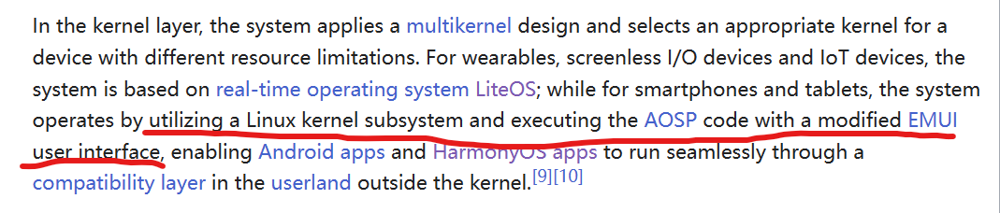
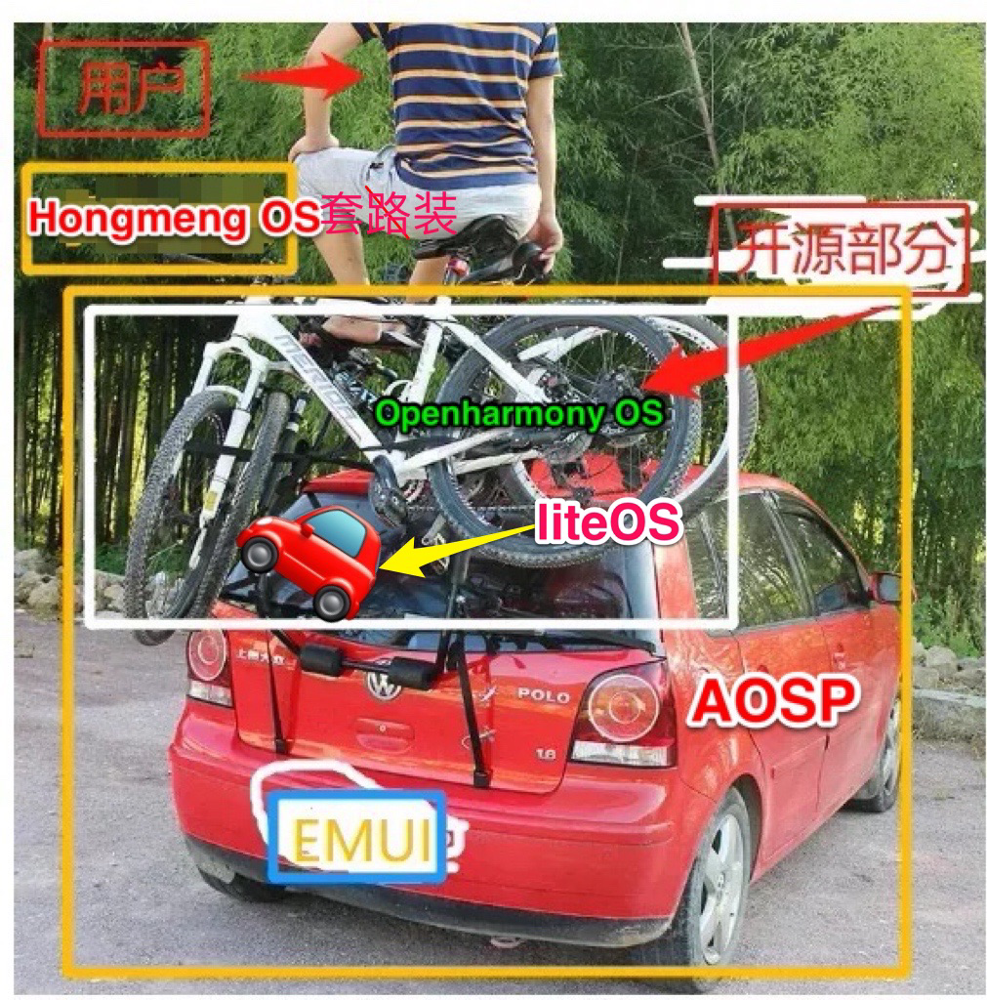

鸿蒙现在还离不开安卓，国内看不明白看看wikipedia就明白了。

鸿蒙是有自己的内核的，但是距离抛弃AOSP的兼容层还是任重道远。毕竟没有人愿意为了一个用户占有量不高的系统重新开发app。吃力不讨好。

据今年八月华为的开发者大会消息，HarmonyOS NEXT的开发者版本已经分发到部分大厂进行原生鸿蒙app的开发了，并且在明年第一季度向所有开发者开放。
> On August 4, 2023 at Huawei Developers Conference 2023 (HDC), Huawei officially announced HarmonyOS NEXT, a standalone [microkernel](https://en.wikipedia.org/wiki/Microkernel "Microkernel")-based distributed operating system, which supports only native [APP](https://en.wikipedia.org/wiki/App_(file_format) "App (file format)") apps via Ark Compiler with [Huawei Mobile Services (HMS)](https://en.wikipedia.org/wiki/Huawei_Mobile_Services "Huawei Mobile Services") support. Based on modified [OpenHarmony](https://en.wikipedia.org/wiki/OpenHarmony "OpenHarmony"), HarmonyOS NEXT has the HarmonyOS microkernel at its core with a single framework. It does not include the compatibility layer of [AOSP](https://en.wikipedia.org/wiki/Android_(operating_system) "Android (operating system)") framework with Android libraries from [EMUI](https://en.wikipedia.org/wiki/EMUI "EMUI") in the [user space](https://en.wikipedia.org/wiki/User_space_and_kernel_space "User space and kernel space") and cannot run Android [apk](https://en.wikipedia.org/wiki/Apk_(file_format) "Apk (file format)") apps natively as the current dual framework HarmonyOS.[[116]](https://en.wikipedia.org/wiki/HarmonyOS#cite_note-116)

