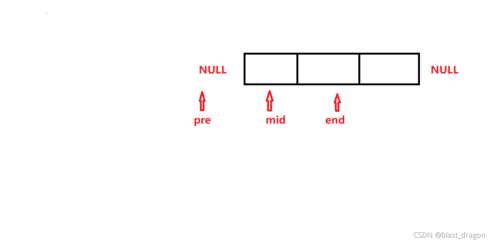
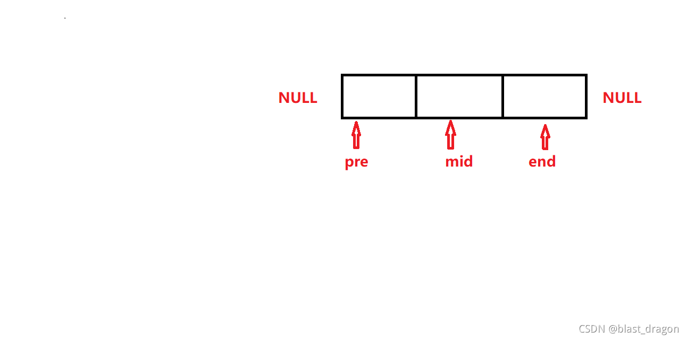
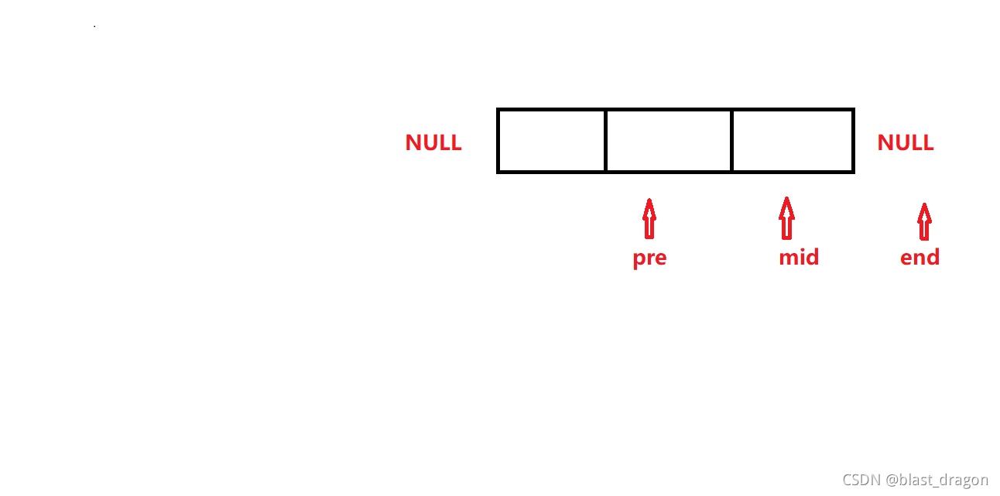

```c
node *iteration(node *p){
    if(p==NULL||p->next==NULL){
        return p;
    }else{
        node *pre=NULL;
        node *mid=p;
        node *end=p->next;
        while(true){
            mid->next=pre;
            if(end==NULL){
                break;
            }
            //整体右移
            pre=mid;
            mid=end;
            end=end->next;
        }
        p=mid;//原来的头指针指向mid（因为此时mid为首元节点）
        return p;
    }
}
```