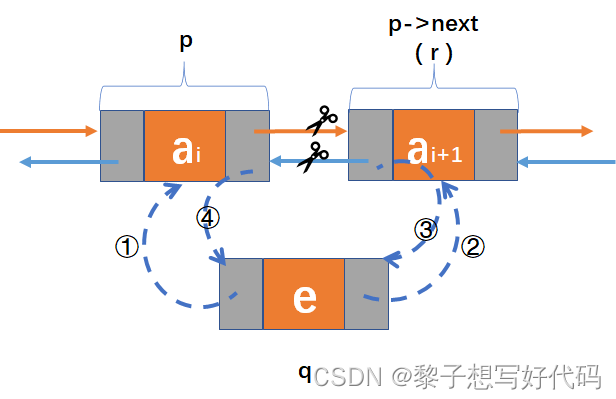

`p->next`
```
struct LinkNode {
  int num;
  struct LinkNode* next;
}

```

`p->next->next`
```
struct LinkNode {
  int num;
  struct LinkNode* --struct LinkNode {
									int num;
									struct LinkNode* next;
								}
}
```





```c
#include<stdio.h>
#include<stdlib.h>
#include<string.h>
//这里我们创建一个结构体
struct LinkNode
{
    int num;
    //看仔细了，这个next是struct LinkNode*  类型的数据
    //它可以去指向本身的数据类型
    struct LinkNode* next;
};
void test01()
{
    //这里我们动态开辟5个struct LinkNode* 的内存
    struct LinkNode* node1 = malloc(sizeof(struct LinkNode));
    struct LinkNode* node2 = malloc(sizeof(struct LinkNode));
    struct LinkNode* node3 = malloc(sizeof(struct LinkNode));
    struct LinkNode* node4 = malloc(sizeof(struct LinkNode));
    struct LinkNode* node5 = malloc(sizeof(struct LinkNode));
    //分别给这五个struct LinkNode* 的数据域赋值
    node1->num = 100;
    node2->num = 200;
    node3->num = 300;
    node4->num = 400;
    node5->num = 500;
    //我们第一块开辟的内存的指针node1他的指针域指向node2这块内存，node2指针域指向node3，所以说next并不是平白无故指向下一个数据，而是next本身是struct LinkNode* ，它可以指向本身数据类型，你创建一个struct LinkNode*数据，都可以用前一个的指针与next来指向他，就构成了链表
    node1->next = node2;
    node2->next = node3;
    node3->next = node4;
    node4->next = node5;
    node5->next = NULL;
    //创建一个struct LinkNode*的指针指向node1；
    struct LinkNode* pCurret = NULL;
    pCurret = node1;
    //pCurret如果不为NULL就继续循环
    while (pCurret!=NULL)
    {
        //这里读取pCurret的数据域
        printf("%d\n", pCurret->num);
        //这里pCurret的指向变为pCurret->next、而由上面代码可知，pCurret->next=node1->next,就是node2，此时pCurret的指向变为node2
        pCurret = pCurret->next;
    }
    //动态开辟要手动释放，防止内存泄漏
    free(node1);
    free(node2);
    free(node3);
    free(node4);
    free(node5);
    //将指针制空
    node1 = NULL;
    node2 = NULL;
    node3 = NULL;
    node4 = NULL;
    node5 = NULL;
}
int main()
{
    test01();
    return 0;
}
```