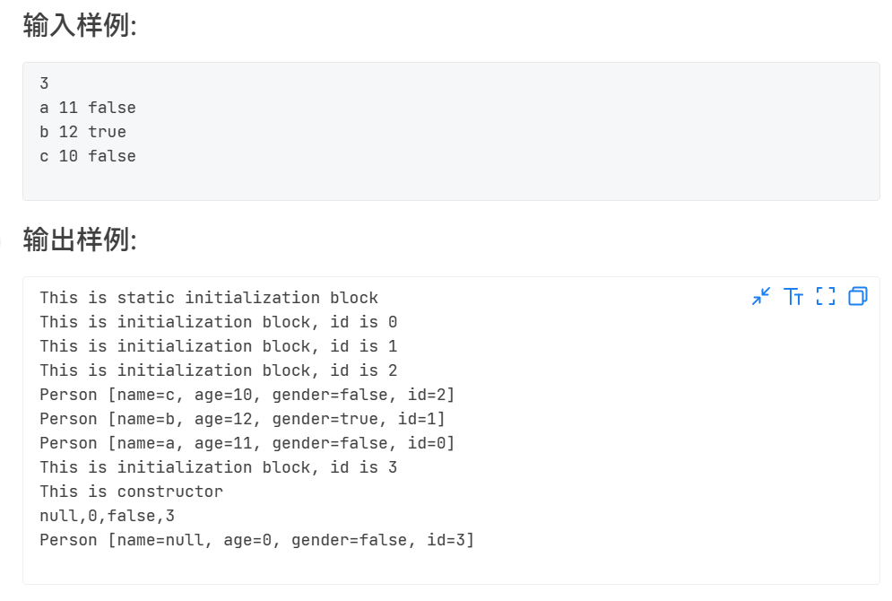

## 什么是初始化块
初始化块是java类的一个成员，与 属性，方法，构造器属于平等地位。
它的主要作用是 初始化 类属性 和 对象属性。
初始化块 是 用花括号 括起来的一段代码块。
## 初始化块的特点
1. 初始化块有两种 ： 普通初始化块 和 静态初始化块。
2. 静态初始化块 是用 static 来修饰的。
3. 一个类中可以有多个初始化块。
4. 初始化块都是被隐式调用的。
5. 静态初始化块 ： 类加载到系统时执行一次。仅能初始化类变量。
6. 普通初始化块 ：在每个对象创建时都会执行一次，且会在构造方法执行之前执行。
7. 相同类型的初始化块的执行顺序是 ： 谁先定义的，谁先执行。
8. 不同类型的初始化块的执行顺序是 ： 先执行 静态初始化块，后执行普通初始化块。

> 7-5 jmu-Java-03面向对象基础-02-构造方法与初始化块

```java
package Class02;

import java.util.Scanner;

public class test01 {
public static void main(String[] args) {
Scanner sc=new Scanner(System.in);
int n=sc.nextInt();
Person p1[]=new Person[n];
for(int i=0;i<n;i++) {
p1[i]=new Person(sc.next(),sc.nextInt(),sc.nextBoolean());
}
for(int i=n-1;i>=0;i--) {
System.out.println(p1[i].toString());
}
Person p2=new Person();
p2.nobody();
System.out.println(p2.toString());
}
}
class Person{
private String name;
private boolean gender;
private int age;
private int id;
private static int _id=0;
public Person() {
System.out.println("This is constructor");
}
public Person(String name, int age, boolean gender) {
super();
this.name = name;
this.gender = gender;
this.age = age;
}
@Override
public String toString() {
return "Person [name=" + name + ", age=" + age + ", gender=" + gender + ", id=" + id + "]";
}
{
this.id=_id;
System.out.println("This is initialization block, id is "+this.id);
Person._id++;
}
static {
System.out.println("This is static initialization block");
}
public void nobody() {
System.out.println(this.name+","+this.age+","+this.gender+","+this.id);
}
}
```

