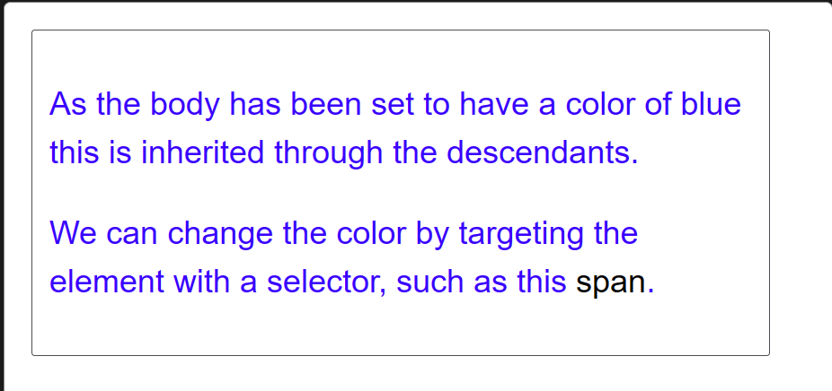

层叠，优先级，继承
## 冲突规则
CSS 代表**层叠样式表**（Cascading Style Sheets），理解第一个词_层叠_（cascade）很重要——层叠的表现方式是理解 CSS 的关键。

在某些时候，在做一个项目过程中你会发现一些应该产生效果的样式没有生效。通常的原因是你创建了两个应用于同一个元素的规则。与[**层叠**](https://developer.mozilla.org/zh-CN/docs/Web/CSS/Cascade)密切相关的概念是[**优先级**（specificity）](https://developer.mozilla.org/zh-CN/docs/Web/CSS/Specificity)，决定在发生冲突的时候应该使用哪条规则。设计元素样式的规则可能不是期望的规则，因此需要了解这些机制是如何工作的。

这里也有[**继承**](https://developer.mozilla.org/zh-CN/docs/Web/CSS/Inheritance)的概念，也就是在默认情况下，一些 css 属性继承当前元素的父元素上设置的值，有些则不继承。这也可能导致一些和期望不同的结果。

## 层叠

样式表[**层叠**](https://developer.mozilla.org/zh-CN/docs/Web/CSS/Cascade)——简单的说，就是 CSS 规则的顺序很重要；当应用两条同级别的规则到一个元素的时候，写在后面的就是实际使用的规则。

我们有两个关于 `<h1>` 的规则。`<h1>` 最后显示蓝色——这两个规则来自同一个源，且具有相同的元素选择器，有相同的优先级，所以顺序在最后的生效。

## 优先级

浏览器是根据[优先级](https://developer.mozilla.org/zh-CN/docs/Web/CSS/Specificity)来决定当多个规则有不同选择器对应相同的元素的时候需要使用哪个规则。它基本上是一个衡量选择器具体选择哪些区域的尺度：

- 一个元素选择器不是很具体，则会选择页面上该类型的所有元素，所以它的优先级就会低一些。
- 一个类选择器稍微具体点，则会选择该页面中有特定 `class` 属性值的元素，所以它的优先级就要高一点。

下面我们再来介绍两个适用于 `<h1>` 的规则。下面的 `<h1>` 最后会显示红色——类选择器 `main-heading` 有更高的优先级，因此就会被应用——即使元素选择器顺序在它后面。
```css
.main-heading { 
    color: red; 
}
        
h1 { 
    color: blue; 
}
```
```html
<h1 class="main-heading">This is my heading.</h1>
```
稍后我们会详细解释优先级算法。

## 继承

继承也需要在上下文中去理解——一些设置在父元素上的 CSS 属性是可以被子元素继承的，有些则不能。

举一个例子，如果你设置一个元素的 `color` 和 `font-family`，每个在里面的元素也都会有相同的属性，除非你直接在元素上设置属性。

```css
body {
    color: blue;
}

span {
    color: black;
}
```
```html
<p>As the body has been set to have a color of blue this is inherited through the descendants.</p>
<p>We can change the color by targeting the element with a selector, such as this <span>span</span>.</p>
```

一些属性是不能继承的——举个例子如果你在一个元素上设置 [`width`](https://developer.mozilla.org/zh-CN/docs/Web/CSS/width) 为 50% ，所有的后代不会是父元素的宽度的 50% 。如果这个也可以继承的话，CSS 就会很难使用了！
:::tip
**备注：** 在 MDN CSS 属性参考页面，你会发现一个名为“形式定义”的技术信息框，其中列举了属性的很多数据信息，包括能否被继承。以 [color 属性的形式定义部分](https://developer.mozilla.org/zh-CN/docs/Web/CSS/color#%E5%BD%A2%E5%BC%8F%E5%AE%9A%E4%B9%89)为例。
:::
## 理解继承

我们从继承开始。下面的例子中我们有一个 [`<ul>`](https://developer.mozilla.org/zh-CN/docs/Web/HTML/Element/ul) 元素，里面有两个无序列表。我们已经给 `<ul>` 设置了边框（border）、内边距（padding）和字体颜色。

`color` 属性是一个继承属性。因此，`color` 属性应用在直接子元素和其后代——直接子元素 `<li>` 和第一个嵌套列表中的子项。然后添加了一个 `special` 类到第二个嵌套列表，其中使用了不同的颜色。然后通过它的子元素继承。


像 `width`（上面提到的）、`margin`、`padding` 和 `border` 不会被继承。如果 border 可以被继承，每个列表和列表项都会获得一个边框——可能就不是我们想要的结果！

## 控制继承

CSS为控制继承提供了五个特殊的通用属性值。每个CSS属性都接收这些值。

[`inherit`](https://developer.mozilla.org/zh-CN/docs/Web/CSS/inherit)

设置该属性会使子元素属性和父元素相同。实际上，就是“开启继承”。

[`initial`](https://developer.mozilla.org/zh-CN/docs/Web/CSS/initial)

将应用于选定元素的属性值设置为该属性的[初始值](https://developer.mozilla.org/zh-CN/docs/Web/CSS/initial_value)。

[`revert` (en-US)](https://developer.mozilla.org/en-US/docs/Web/CSS/revert "Currently only available in English (US)")

将应用于选定元素的属性值重置为浏览器的默认样式，而不是应用于该属性的默认值。在许多情况下，此值的作用类似于 [`unset`](https://developer.mozilla.org/zh-CN/docs/Web/CSS/unset)。

[`revert-layer` (en-US)](https://developer.mozilla.org/en-US/docs/Web/CSS/revert-layer "Currently only available in English (US)")

将应用于选定元素的属性值重置为在上一个[层叠层](https://developer.mozilla.org/zh-CN/docs/Web/CSS/@layer)中建立的值。

[`unset`](https://developer.mozilla.org/zh-CN/docs/Web/CSS/unset)

将属性重置为自然值，也就是如果属性是自然继承那么就是 `inherit`，否则和 `initial` 一样

## 重设所有属性值

CSS 的简写属性 [`all`](https://developer.mozilla.org/zh-CN/docs/Web/CSS/all) 可以用于同时将这些继承值中的一个应用于（几乎）所有属性。它的值可以是其中任意一个（`inherit`、`initial`、`unset` 或 `revert`）。这是一种撤销对样式所做更改的简便方法，以便回到之前已知的起点。
例：
```css
blockquote {
	background-color: orange;
	border: 2px solid blue;
}

.fix-this {
	all: unset;
}
```
```html
		<blockquote>
		    <p>This blockquote is styled</p>
		</blockquote>
		<blockquote class="fix-this">
			<p>This blockquote is note styled</p>
		</blockquote>
```


## 理解层叠

我们要了解层叠如何定义不止一个元素的时候怎么应用CSS规则。

有三个因素需要考虑，根据重要性排序如下，后面的更重要：

**1.资源顺序**
**2.优先级**
**3.重要程度**

### 资源顺序

我们已经看到了顺序对于层叠的重要性。如果你有超过一条规则，而且都是相同的权重，那么最后面的规则会应用。可以理解为后面的规则覆盖前面的规则，直到最后一个开始设置样式。

### 优先级

你会发现在一些情况下，有些规则在最后出现，但是却应用了前面的具有冲突的规则。这是因为前面的有更高的**优先级**——它范围更小，因此浏览器就把它选择为元素的样式。

就像前面看到的，*类选择器*的权重大于*元素选择器*，因此类上定义的属性将覆盖应用于元素上的属性。

这里需要注意虽然我们考虑的是选择器，以及应用在选中对象上的规则，但不会覆盖所有规则，只覆盖相同的属性。

这样可以避免重复的 CSS。一种常见的做法是给基本元素定义通用样式，然后给不同的元素创建对应的类。举个例子，在下面的样式中我给 2 级标题定义了通用样式，然后创建了一些类只修改部分属性的值。最初定义的值应用于所有标题，然后更具体的值通过对应类来实现。


```css
h2 {
	font-size: 2em;
	color: #000;
	font-family: Georgia, 'Times New Roman', Times, serif;
}

.small {
font-size: 1em;
}

.bright {
color: rebeccapurple;
}
```
```html
<h2>Heading with no class</h2>
<h2 class="small">Heading with class of small</h2>
<h2 class="bright">Heading with class of bright</h2>
```
现在让我们来看看浏览器如何计算优先级。我们已经知道一个元素选择器比类选择器的优先级更低，会被其覆盖。本质上，不同类型的选择器有不同的分数值，把这些分数相加就得到特定选择器的权重，然后就可以进行匹配。

一个选择器的优先级可以说是由三个不同的值（或分量）相加，可以认为是百（ID）十（类）个（元素）——三位数的三个位数：

- **ID**：选择器中包含 ID 选择器则百位得一分。
- **类**：选择器中包含类选择器、属性选择器或者伪类则十位得一分。
- **元素**：选择器中包含元素、伪元素选择器则个位得一分。

:::note
**备注：** 通用选择器（[`*`](https://developer.mozilla.org/zh-CN/docs/Web/CSS/Universal_selectors)）、组合符（`+`、`>`、`~`、' '）和调整优先级的选择器（[`:where()`](https://developer.mozilla.org/zh-CN/docs/Web/CSS/:where)）不会影响优先级。
:::

否定（[`:not()`](https://developer.mozilla.org/zh-CN/docs/Web/CSS/:not)）和任意匹配（[`:is()`](https://developer.mozilla.org/zh-CN/docs/Web/CSS/:is)）伪类本身对优先级没有影响，但它们的参数则会带来影响。**参数中，对优先级算法有贡献的参数的优先级的最大值将作为该伪类选择器的优先级。**

下面有几个单独的例子，有空可以看看。试着思考下，理解为什么优先级是这样定的。我们还没有深入介绍选择器，不过你可以在 MDN 的[选择器参考页面](https://developer.mozilla.org/zh-CN/docs/Web/CSS/CSS_selectors)找到每个选择器的详细信息。

|选择器|ID|类|元素|优先级|
|---|---|---|---|---|
|`h1`|0|0|1|0-0-1|
|`h1 + p::first-letter`|0|0|3|0-0-3|
|`li > a[href*="en-US"] > .inline-warning`|0|2|2|0-2-2|
|`#identifier`|1|0|0|1-0-0|
|`button:not(#mainBtn, .cta)`|1|0|1|1-0-1|

在我们继续之前，先看看这个示例。

```css
/* 1. specificity: 1-0-1 */
#outer a {
    background-color: red;
}
        
/* 2. specificity: 2-0-1 */
#outer #inner a {
    background-color: blue;
}

/* 3. specificity: 1-0-4 */
#outer div ul li a {
    color: yellow;
}

/* 4. specificity: 1-1-3 */
#outer div ul .nav a {
    color: white;
}

/* 5. specificity: 0-2-4 */
div div li:nth-child(2) a:hover {
    border: 10px solid black;
}

/* 6. specificity: 0-2-3 */
div li:nth-child(2) a:hover {
    border: 10px dashed black;
}

/* 7. specificity: 0-3-3 */
div div .nav:nth-child(2) a:hover {
    border: 10px double black;
}

a {
    display: inline-block;
    line-height: 40px;
    font-size: 20px;
    text-decoration: none;
    text-align: center;
    width: 200px;
    margin-bottom: 10px;
}

ul {
    padding: 0;
}

li {
    list-style-type: none;
}            
```
```html
<div id="outer" class="container">
    <div id="inner" class="container">
        <ul>
            <li class="nav"><a href="#">One</a></li>
            <li class="nav"><a href="#">Two</a></li>
        </ul>
    </div>
</div>
    
```


Hover后：


这里发生了什么？首先，我们先看看最上面的选择器规则，你会发现，我们已经把优先级计算出来放在最前面的注释里。

- 前面两个选择器都是链接背景颜色的样式——第二个赢了使得背景变成蓝色，因为它多了一个 ID 选择器：优先级 2-0-1 vs. 1-0-1。
- 第三四个选择器都是链接文本颜色样式——后者赢了使得文本变成白色，因为它虽然少一个元素选择器，但是多了一个类选择器。所以优先级是 1-1-3 vs. 1-0-4。
- 第 5 到 7 个选择器都是鼠标悬停时链接边框样式。第六个显然输给了第五个，优先级是 0-2-3 vs. 0-2-4——少了个元素选择器。第七个，比第五第六都高——子选择器数量相同，但是有一个元素选择器变成类选择器。所以最后优先级是 0-3-3 vs. 0-2-3 和 0-2-4。
:::note
**备注：** 每一个选择器类编都有它自己的优先级等级，它们不会被具有较低优先级的选择器覆盖。例如，权重为_一百万_的**类**选择器不会覆盖权重为_一_的 **ID** 选择器。

评估优先级的最佳方法是对不同的优先级等级单独进行评分，并从最高的等级开始，必要时再计算低优先级等级的权重。即，仅当某一列的优先级权重相同时，你才需要评估下一列；否则，你可以直接忽略低等级的选择器，因为它们无法覆盖高优先级等级的选择器。
:::

### 内联样式

内联样式，即 [`style`](https://developer.mozilla.org/zh-CN/docs/Web/HTML/Global_attributes#style) 属性内的样式声明，优先于所有普通的样式，无论其优先级如何。这样的声明没有选择器，但它们的优先级可以理解为 1-0-0-0；即无论选择器中有多少个 ID，它总是比其他任何优先级的权重都要高。

请注意，建议在单独的文件中定义样式。该属性和 [`<style>`](https://developer.mozilla.org/zh-CN/docs/Web/HTML/Element/style) 元素主要用于快速添加样式，例如用于测试目的。

### !important

有一个特殊的 CSS 可以用来覆盖所有上面所有优先级计算，不过需要很小心的使用——`!important`。用于修改特定属性的值，能够覆盖普通规则的层叠。
:::note
**备注：** 了解 `!important` 是为了在阅读别人代码的时候知道有什么作用。**但是，强烈建议除了非常情况不要使用它。**`!important` 改变了层叠的常规工作方式，它会使调试 CSS 问题非常困难，特别是在大型样式表中。
:::

看看这个示例，有两个段落，其中一个有 ID。

```css
#winning {
    background-color: red;
    border: 1px solid black;
}
    
.better {
    background-color: gray;
    border: none !important;
}
    
p {
    background-color: blue;
    color: white;
    padding: 5px;
}           
```
```html
<p class="better">This is a paragraph.</p>
<p class="better" id="winning">One selector to rule them all!</p>
```

:::note
**备注：** 覆盖 `!important` 唯一的办法就是另一个 `!important` 具有相同_优先级_而且顺序靠后，或者更高优先级。
:::
在一种情况下，你可能不得不使用它：当你不能编辑核心的 CSS 模块，不能用任何其他方式覆盖，而你又真的想要覆盖一个样式时。但说真的，如果可以避免的话就不要用它。

## CSS位置的影响

最后，也很有用，CSS 声明的优先级取决于定义它的样式表和级联层。

它让用户可以设置自定义样式表来覆盖开发人员定义的样式。例如用户可能视力受损，并想在所有网页上设置两倍的正常字体大小，以便更容易进行阅读。

也可以在级联层中声明开发人员定义的样式：你可以让非分层样式覆盖分层样式，或者你可以让后面的层中声明的样式覆盖先前的层中声明的样式。例如，作为开发人员，你可能无法编辑第三方的样式表，但你可以将外部的样式表导入级联层中，以便你自己的样式可以轻松地覆盖导入的样式，无需担心第三方选择器的优先级。

### 覆盖声明的顺序

相互冲突的声明将按以下顺序应用，后一种声明将覆盖前一种声明：

1. 用户代理样式表中的声明（例如，浏览器的默认样式，在没有设置其他样式时使用）。
2. 用户样式表中的常规声明（由用户设置的自定义样式）。
3. 作者样式表中的常规声明（这些是我们 web 开发人员设置的样式）。
4. 作者样式表中的 `!important` 声明
5. 用户样式表中的 `!important` 声明
6. 用户代理样式表中的 `!important` 声明
:::note
**备注：** 标记为 `!important` 的样式的优先级顺序是颠倒的。web 开发人员的样式表覆盖用户的样式表是有意义的，因此设计可以按预期进行，但是有时用户有充足的理由覆盖 web 开发人员的样式，正如上面提到的——这可以通过在他们的规则中使用 `!important` 来实现。
:::

## 级联层的顺序

(cascade layers)

在级联层中声明CSS，优先级的顺序由声明层的顺序来决定。

原文说的很仔细很明白：

在级联层中声明 CSS 是，优先级的顺序由声明层的顺序来决定。在任何层之外声明的 CSS 样式会被按声明的顺序组合在一起，形成一个未命名的层，**它会被当作最后声明的层**。对于存在冲突的常规（没有 `!important` 声明）样式，后面的层比先前定义的层的优先级高。但对于带有 `!important` 标记的样式，其顺序相反——先前的层中的 important 样式比后面的层以及为在层中声明的 important 样式优先级要高。但内联样式比所有作者定义的样式的优先级都要高，不受级联层规则的影响。

当你在不同的层中有多个样式块，且其中提供了对于某一元素的单一属性的相互冲突的值时，声明该冲突样式的层的顺序将决定其优先级。而不是高优先级的层直接覆盖低优先级的层中的所有样式。需要注意的是单独的一个层中的样式的优先级仍旧会起作用。
```css
@layer firstLayer, secondLayer;

p { /* 0-0-1 */
  background-color: red;
  color: grey !important;
  border: 5px inset purple;
}
p#addSpecificity { /* 1-0-1 */
  border-style: solid !important;
}

@layer firstLayer {
  #addSpecificity { /* 1-0-0 */
    background-color: blue;
    color: white !important;
    border-width: 5px;
    border-style: dashed !important;
  }
}

@layer secondLayer {
  p#addSpecificity { /* 1-0-1 */
    background-color: green;
    color: orange !important;
    border-width: 10px;
    border-style: dotted !important;
  }
}     
```
```html
<p id="addSpecificity">
  A paragraph with a border and background
</p>
```

让我们讨论一下上例以了解发生了什么。示例中，声明了两个级联层，按 `firstLayer` 和 `secondLayer` 的顺序声明。即使 `secondLayer` 的优先级更高，但其中声明的样式没有被使用。为什么？因为不分层的常规样式具有更高的优先级，覆盖了层中的常规样式，不论层的优先级如何，而具有 important 的样式，则是先前声明的层会覆盖后声明的层，而不是层的优先级。

如果你修改示例中 CSS 的第一行为 `@layer secondLayer, firstLayer;`，就会修改层声明的顺序，所有 `firstLayer` 中的 important 样式会被 `secondLayer` 中的冲突值覆盖。

