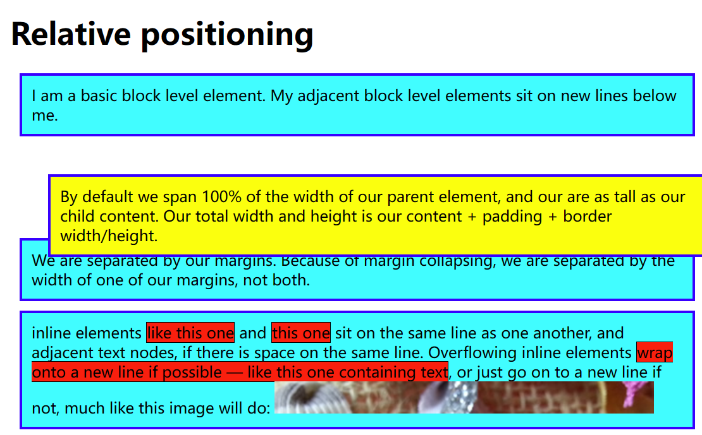
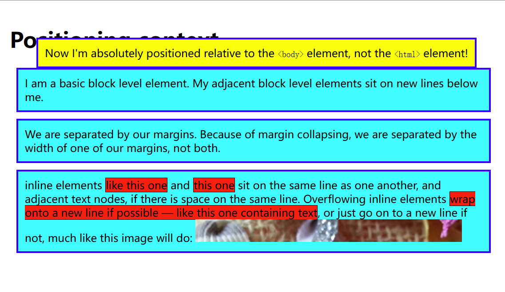

定位

## 我们可以复习一下文档流

`display: block;`新的元素会在新行中出现。

但是inline（内联）元素表现不一样，新的元素不会出现在新行上，他们会位于同一行上，只要有空间。如果没有才会换行。

还有一件事是[外边距折叠](https://developer.mozilla.org/zh-CN/docs/Web/CSS/CSS_box_model/Mastering_margin_collapsing)，上下外边距有时候会重叠，边距取最大值。注意：有设定[浮动](https://developer.mozilla.org/zh-CN/docs/Web/CSS/float)和[绝对定位](https://developer.mozilla.org/zh-CN/docs/Web/CSS/position#%E5%AE%9A%E4%BD%8D%E7%B1%BB%E5%9E%8B)的元素不会发生外边距折叠。

## 介绍定位

`position:`

`static/absolute/relative/fixed/sticky`

### 静态定位

默认就是`static`。

### 相对定位

```css
position: relative;
```
`top/bottom/left/right`
```css
top: 30px;
left: 30px;
```

会以原来的位置为基准，以`top/bottom/left/right`向外推。


### 绝对定位

```css
position: absolute;
```

元素脱离正常文档布局流，到一个**新层**中（`<body>`中，但是可以改变，下面一个标题会说）。

注意：margin会影响定位元素。

:::note
是的，margins 仍会影响定位的元素。然而 margin collapsing 不会。
:::
#### 哪个元素是绝对定位的包含元素？
取决于父元素的position属性。

元素会脱离`<html>`放到`<body>`中，但是通过改变父元素为
```css
position: relative;
```
可以让绝对定位的元素依附在这个父元素上。



### z-index

网页也有一个 z 轴：一条从屏幕表面到你的脸（或者在屏幕前面你喜欢的任何其他东西）的虚线。[`z-index`](https://developer.mozilla.org/zh-CN/docs/Web/CSS/z-index) 值影响定位元素位于该轴上的位置；正值将它们移动到堆栈上方，负值将它们向下移动到堆栈中。默认情况下，定位的元素都具有 z-index 为 auto，实际上为 0。

```css
p:nth-of-type(1) {
  position: absolute;
  background: lime;
  top: 10px;
  right: 30px;
}
```
```css
z-index: 1;
```

z-index 只接受无单位索引值，2和3与3000和40000的效果一样。

### 固定定位
`fixed`

设置固定高度。
```css
h1 {
  position: fixed;
  top: 0;
  width: 500px;
  margin: 0 auto;
  background: white;
  padding: 10px;
}
```

### position: sticky

```css
.positioned {
  position: sticky;
  top: 30px;
  left: 30px;
}
```

当滚动到上30px，左30px时，就粘住了。

#### 滚动索引

[定位 - 学习 Web 开发 | MDN (mozilla.org)](https://developer.mozilla.org/zh-CN/docs/Learn/CSS/CSS_layout/Positioning#position_sticky)

一个很神奇的应用。

