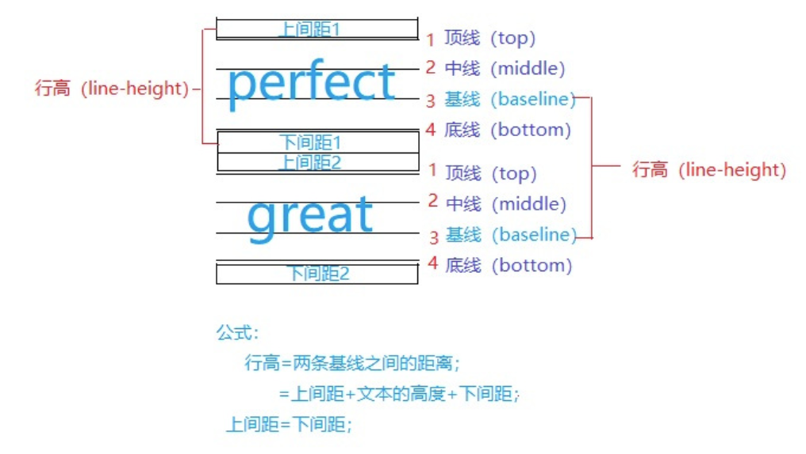
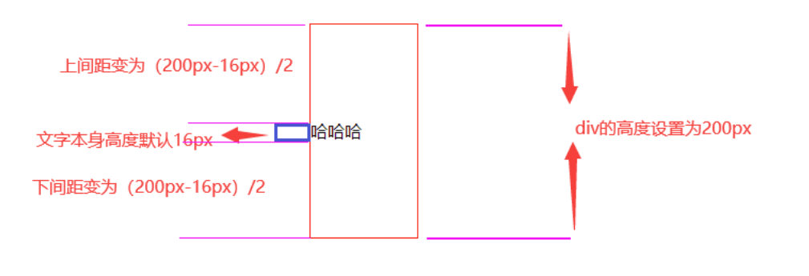
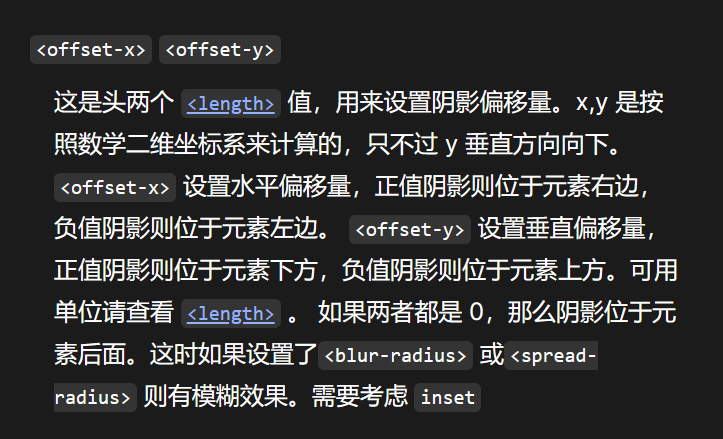

```css
display: block;
margin: 0 auto;
```
margin可取值
```css
/* 应用于所有边 */
margin: 1em;
margin: -3px;

/* 上边下边 | 左边右边 */
margin: 5% auto;

/* 上边 | 左边右边 | 下边 */
margin: 1em auto 2em;

/* 上边 | 右边 | 下边 | 左边 */
margin: 2px 1em 0 auto;

/* 全局值 */
margin: inherit;
margin: initial;
margin: unset;
```

`filter`只是图片添加过滤
`<blur-radius>`模糊半径

```css
/* offset-x | offset-y | blur-radius | color */
text-shadow: 1px 1px 2px black;

/* color | offset-x | offset-y | blur-radius */
text-shadow: #fc0 1px 0 10px;

/* offset-x | offset-y | color */
text-shadow: 5px 5px #558abb;

/* color | offset-x | offset-y */
text-shadow: white 2px 5px;

/* offset-x | offset-y
/* Use defaults for color and blur-radius */
text-shadow: 5px 10px;

/* Global values */
text-shadow: inherit;
text-shadow: initial;
text-shadow: unset;
```

## 关于行高（line-height）


```html
<!DOCTYPE html>
<html>
	<head>
		<meta charset="utf-8">
		<title></title>
		<style type="text/css">
			.container {
				width: 100px;
				height: 200px;
				line-height: 200px;
				margin: 0 auto;				
				border: 1px solid red;
			}
		</style>
	</head>
	<body>
		<div class="container">
			哈哈哈
		</div>
	</body>
</html>
```


这样就解释为什么line-height设置成div高度就可以使文本居中了。

还有一种换行的情况，详情见[你经常用的line-height使内容垂直居中，你真的懂它的原理吗？_line-height居中_丑小鸭变黑天鹅的博客-CSDN博客](https://blog.csdn.net/qq_41880073/article/details/115025963)

由于 `<gradient>` 属于 `<image>` 数据类型，因此只能用在能使用 [`<image>`](https://developer.mozilla.org/zh-CN/docs/Web/CSS/image) 的地方。因此，`linear-gradient()` 在 [`background-color`](https://developer.mozilla.org/zh-CN/docs/Web/CSS/background-color) 以及其他使用 [`<color>`](https://developer.mozilla.org/zh-CN/docs/Web/CSS/color_value) 数据类型的属性上不起作用。


这个说的是对的，但是要注意的是如果应用了`inset`属性，那么**x轴和y轴是完全翻转的**。也就是x轴正向向左，y轴正向向上，

但是对于数值和单位现在没有没有搞清楚。//todo