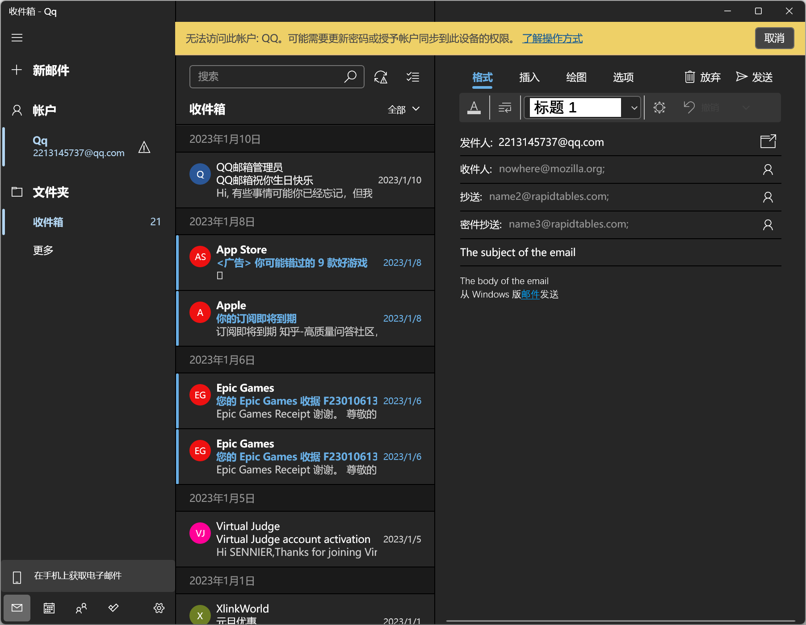

```
<p>
 I'm creating a link to
 <a href= "https://www.mozilla.org/en-US/">the Mozilla homepage</a>
</p>
```
## Block level links
```
<a href= "https://developer.mozilla.org/en-US/"
 <h1>MDN Web Docs</h1>
</a>
<p>
Documenting web technologies,including CSS,HTML,and JavaScript,since 2005.
</p>
```

## Image links
```
<a href= "https://developer.mozilla.org/en-US">
 
</a>
```

## Adding supporting information
```
<p>
 I'm creating a link to 
 <a>
 href= "https://www.org/en-US/"
 title= "The best place to find more information about Mozilla's
		 mission and how to contribute">
		 the Mozilla homepage</a>
</p>
```
URL = Uniform Resource Locator

Same directory
```
<a href= "contacts.html">contacts page</a>
```
Moving down into subdirectories
```
<p>Visit my<a href="projects/index.html">project homepage</a>.</p>
```
Moving back into parent directories
```
<p>A link to my <a href= "../pdfs/profect-brief.pdf">project brief</a></p>
```

**Note:** You can combine multiple instances of these features into complex URLs, if needed, for example: `../../../complex/path/to/my/file.html`.

(#)hash/pound symbol

## Document fragments

要用`id`来specific在URL的末尾加`#`

```
这个文件中的
<h2 id= "Mailing_address">Mailing address</h2>

在另一个网页中加
<a href= "contacts.html#Mailing_address">mailing address</a>.
就是一个链接，点击就会跳转到那个网页中的相关段落。

也可以直接引用来到达现在文档的某一个位置
The <a href="#Mailing_address">company mailing address</a> can be found at the bottom of this page.
```

## absolute URL and relative URL

绝对位置就是绝对的`https://www.example.com/projects/index.html`
相对位置就是相对的相对于目前来说

Points to a location that is _relative_ to the file you are linking from, more like what we looked at in the previous section. For example, if we wanted to link from our example file at `https://www.example.com/projects/index.html` to a PDF file in the same directory, the URL would just be the filename — `project-brief.pdf` — no extra information needed. If the PDF was available in a subdirectory inside `projects` called `pdfs`, the relative link would be `pdfs/project-brief.pdf` (the equivalent absolute URL would be `https://www.example.com/projects/pdfs/project-brief.pdf`.)

## 使用download属性当链接下载时

```
<a
  href= "https://download.mozilla.org/?product=firefox-latest-ssl&os-win64&lang=en-US"
  download= "firefox-latest-64bit-installer.exe">
  Download Latest Firefox for Windows(64-bit) (English, US)
</a>
```

## mailto URL scheme

```
<a href= "mailto:nowhere@mozilla.org">Send email to nowhere</a>
```

如果你omit *(忽略)* it并且你的href是"mailto:",当用户点击时会弹出邮件窗口但是没有指定地址，这常常用在"分享”时。

## 指定细节

可以指定邮件头字段(field)
常用"cc","bcc","subject","body".
Carbon copy  Blind Carbon copy  
分别代表"抄送","密件抄送","主题","内容".
```
<a
  href="mailto:nowhere@mozilla.org?cc=name2@rapidtables.com&bcc=name3@rapidtables.com&subject=The%20subject%20of%20the%20email&body=The%20body%20of%20the%20email">
  Send mail with cc, bcc, subject and body
</a>
```



**Note:** The values of each field must be URL-encoded with non-printing characters (invisible characters like tabs, carriage returns, and page breaks) and spaces [percent-escaped](https://en.wikipedia.org/wiki/Percent-encoding). Also, note the use of the question mark (`?`) to separate the main URL from the field values, and ampersands (&) to separate each field in the `mailto:` URL. This is standard URL query notation. Read [The GET method](https://developer.mozilla.org/en-US/docs/Learn/Forms/Sending_and_retrieving_form_data#the_get_method) to understand what URL query notation is more commonly used for.
