我们先从ASCII和Unicode开始。

ASCII 编码一共定义了128个字符的编码规则，用七位二进制表示 ( 0x00 - 0x7F ), 这些字符组成的集合就叫做 ASCII 字符集

Unicode 字符集的编码范围是 **0x0000 - 0x10FFFF**，可以容纳一百多万个字符。每个字符都有一个独一无二的编码，也即每个字符都有一个二进制数值和它对应，这里的二进制数值也叫 **码点** ,比如：汉字 **"中"** 的 码点是 **0x4E2D**, 大写字母 **A** 的码点是 **0x41**, 具体字符对应的 Unicode 编码可以查询 [Unicode字符编码表](https://link.zhihu.com/?target=https%3A//home.unicode.org/)

## 字符集和字符编码

字符集是很多个字符的集合，字符编码是字符集的一种实现方式，把字符集中的字符映射为特定的字节或字节序列，它是一种规则。

比如：Unicode 只是字符集，UTF-8、UTF-16、UTF-32 才是真正的字符编码规则
:::note
注意：GB18030 既是字符集又是编码格式，也即字符在字符集中的编号以及存储是进行编码用的编号是完全相同的，而 Unicode 仅仅是字符集，它只规定了字符的唯一编号，它的存储是用其他的编码格式的，比如 UTF8、UTF16 等等。
:::

## Unicode、UTF-8、UTF-16、UTF-32
### Unicode 字符存储

Unicode 字符集的编码范围是 **0x0000 - 0x10FFFF**，因此需要 1 到 3 个字节来表示

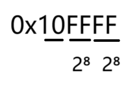

然而在Unicode中，有的字符只需要一个字节，而有的需要三个字节。为了不浪费资源，Unicode有了许多种编码格式（存储方式），UTF-8、UTF-16、UTF-32。

UTF-8、UTF-16、UTF-32 中的 "UTF" 是 "Unicode Transformation Format" 的缩写，意思是"Unicode 转换格式"，后面的数 字表明至少使用多少个比特位来存储字符, 比如：UTF-8 最少需要8个比特位也就是一个字节来存储，对应的， UTF-16 和 UTF-32 分别需要最少 2 个字节 和 4 个字节来存储。

### UTF-8
UTF-8: 是一种**变长字符编码**，被定义为将码点编码为 1 至 4 个字节，具体取决于码点数值中有效二进制位的数量。

UTF-8 的编码规则:

1. 对于单字节的符号，字节的第一位设为 **0**，后面 7 位为这个符号的 Unicode 码。因此对于英语字母，UTF-8 编码和 ASCII 码是相同的, 所以 **UTF-8 能兼容 ASCII 编码**，这也是互联网普遍采用 UTF-8 的原因之一
2. 对于 **n** 字节的符号（ **n > 1**），第一个字节的前 **n** 位都设为 **1**，第 **n + 1** 位设为 **0**，后面字节的前两位一律设为 **10** 。剩下的没有提及的二进制位，全部为这个符号的 Unicode 码

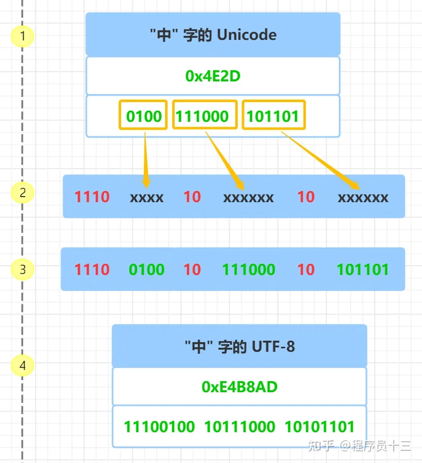

首先查询 **"中"** 字的 Unicode 码 **0x4E2D**, 转成二进制, 总共有 16 个二进制位， 具体如上图，**"中"** 字的 UTF-8 编码 需要 **3** 个字节，即格式是 **1110**xxxx **10**xxxxxx **10**xxxxxx

### UTF-16 编码

UTF-16 也是一种变长字符编码, 这种编码方式比较特殊, 它将字符编码成 2 字节 或者 4 字节

具体的编码规则如下:

1. 对于 Unicode 码小于 **0x10000** 的字符， 使用 **2** 个字节存储，并且是直接存储 Unicode 码，不用进行编码转换
2. 对于 Unicode 码在 **0x10000** 和 **0x10FFFF** 之间的字符，使用 **4** 个字节存储，这 **4** 个字节分成前后两部分，每个部分各两个字节，其中，前面两个字节的前 **6** 位二进制固定为 **110110**，后面两个字节的前 6 位二进制固定为 **110111**, 前后部分各剩余 10 位二进制表示符号的 Unicode 码 减去 **0x10000** 的结果
3. 大于 **0x10FFFF** 的 Unicode 码无法用 UTF-16 编码

前面提到过，**"中"** 字的 Unicode 码是 **4E2D**, 它小于 **0x10000**，根据表格可知，它的 UTF-16 编码占两个字节，并且和 Unicode 码相同，所以 **"中"** 字的 UTF-16 编码为 **4E2D**

我从 [Unicode字符表网站](https://link.zhihu.com/?target=https%3A//unicode-table.com/cn/) 找了一个老的南阿拉伯字母, 它的 Unicode 码是: **0x10A6F** , 可以访问 [https://unicode-table.com/cn/10A6F/](https://link.zhihu.com/?target=https%3A//unicode-table.com/cn/10A6F/) 查看字符的说明, Unicode 码对应的字符如下图所示
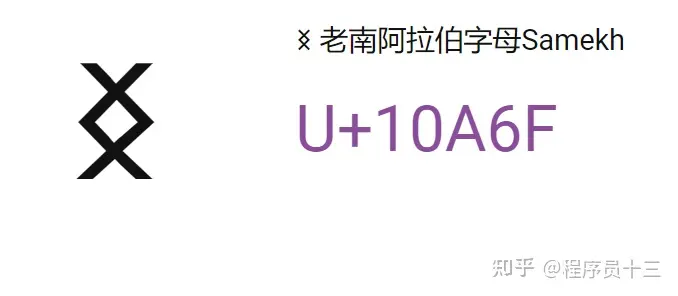

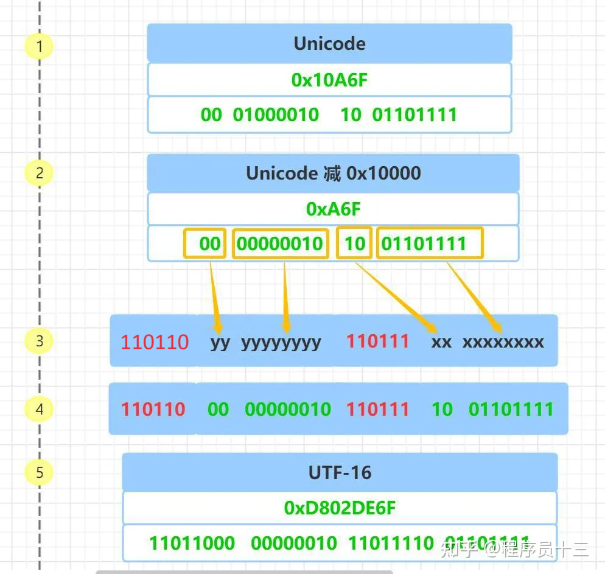

### UTF-32 编码

UTF-32 是固定长度的编码，始终占用 4 个字节，足以容纳所有的 Unicode 字符，所以直接存储 Unicode 码即可，不需要任何编码转换。虽然浪费了空间，但提高了效率。

### UTF-8、UTF-16、UTF-32 之间如何转换

UTF-8、UTF-16、UTF-32 通过这三种编码的二进制表示，也能获得对应的 Unicode 码，有了字符的 Unicode 码，按照上面介绍的 UTF-8、UTF-16、UTF-32 的编码方法 就能转换成任一种编码了

### UTF 字节序

最小编码单元是多字节才会有字节序的问题存在，UTF-8 最小编码单元是一字节，所以 它是没有字节序的问题，UTF-16 最小编码单元是 2 个字节，在解析一个 UTF-16 字符之前，需要知道每个编码单元的字节序

比如：前面提到过，**"中"** 字的 Unicode 码是 **4E2D**, **"ⵎ"** 字符的 Unicode 码是 **2D4E**， 当我们收到一个 UTF-16 字节流 **4E2D** 时，计算机如何识别它表示的是字符 **"中"** 还是 字符 **"ⵎ"** 呢 ?

所以，对于多字节的编码单元，需要有一个标记显式的告诉计算机，按照什么样的顺序解析字符，也就是字节序，字节序分为 大端字节序 和 小端字节序

小端字节序简写为 LE( Little-Endian ), 表示 低位字节在前，高位字节在后, 高位字节保存在内存的高地址端，而低位字节保存在内存的低地址端

大端字节序简写为 BE( Big-Endian ), 表示 高位字节在前，低位字节在后，高位字节保存在内存的低地址端，低位字节保存在在内存的高地址端

下面以 **0x4E2D** 为例来说明大端和小端，具体参见下图:
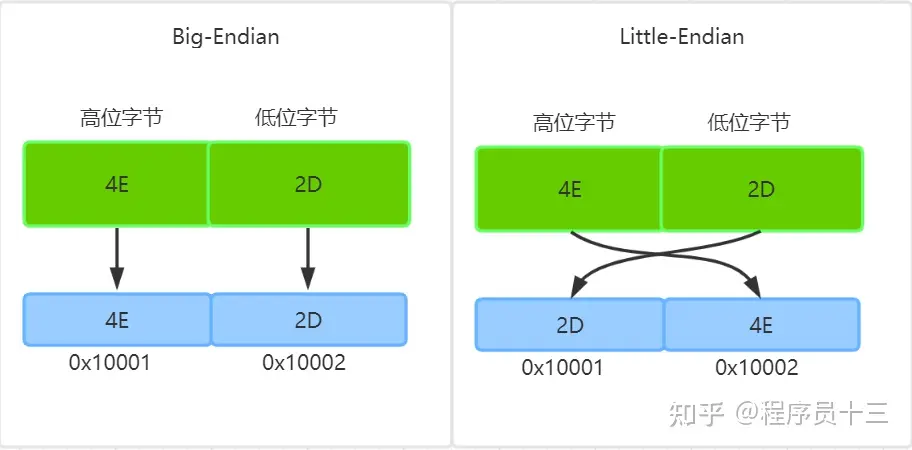

数据是从高位字节到低位字节显示的，这也更符合人们阅读数据的习惯，而内存地址是从低地址向高地址增加

所以，字符**0x4E2D** 数据的高位字节是 **4E**，低位字节是 **2D**

按照大端字节序的高位字节保存内存低地址端的规则，**4E** 保存到低内存地址 **0x10001** 上，**2D** 则保存到高内存地址 **0x10002** 上

对于小端字节序，则正好相反，数据的高位字节保存到内存的高地址端，低位字节保存到内存低地址端的，所以 **4E** 保存到高内存地址 **0x10002** 上，**2D** 则保存到低内存地址 **0x10001** 上

### BOM

BOM 是 byte-order mark 的缩写，是 "字节序标记" 的意思, 它常被用来当做标识文件是以 UTF-8、UTF-16 或 UTF-32 编码的标记

在 Unicode 编码中有一个叫做 "零宽度非换行空格" 的字符 ( ZERO WIDTH NO-BREAK SPACE ), 用字符 **FEFF** 来表示

对于 UTF-16 ，如果接收到以 **FEFF** 开头的字节流， 就表明是大端字节序，如果接收到 **FFFE**， 就表明字节流 是小端字节序

UTF-8 没有字节序问题，上述字符只是用来标识它是 UTF-8 文件，而不是用来说明字节顺序的。"零宽度非换行空格" 字符 的 UTF-8 编码是 **EF BB BF**, 所以如果接收到以 **EF BB BF** 开头的字节流，就知道这是UTF-8 文件
## GB2312、GBK、GB18030

### 编码方式

ASICII、GB2312、GBK、GB18030 之间的关系可以用下图表示

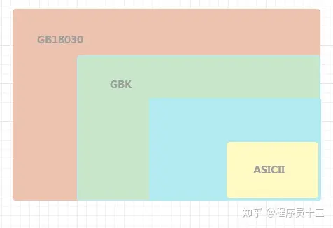

GB2312 兼容 ASICII 编码, GBK 兼容 GB2312 编码，GB18030 兼容 GB2312 编码 和 GBK 编码

实际生活中，我们用到的 99% 的汉字，都属于 GB2312 编码范围 ，GB2312 每个编码对应的是哪个汉字可以参考 [GB2312简体中文编码表](https://link.zhihu.com/?target=http%3A//tools.jb51.net/table/gb2312)， GBK 编码可以参考 [GBK编码表](https://link.zhihu.com/?target=https%3A//www.qqxiuzi.cn/zh/hanzi-gbk-bianma.php)， GB18030 可以参考 [GB18030-2005](https://link.zhihu.com/?target=https%3A//ia601204.us.archive.org/20/items/GB18030-2005/GB%252018030-2005.pdf) 文档。

### GB2312 编码

GB2312 把每个汉字都编码成两个字节，第一个字节是高位字节，第二个字节是低位字节

GB2312 为了兼容 ASICII ，其编码需要进行一些转换才能避免和 ASICII 编码重叠，转换的过程涉及到区位码和国标码的概念，下面说明转成内码的过程

- 区位码

GB2312 对汉字进行了分区处理，每个区含有 94 个汉字或者字符，总共有 94 个区，每个汉字或者字符都对应一个 分区编号和分区内的位置编号，称为 区位码

比如：汉字 "中" 字的 分区编号是 54，分区内位置编号是 48，所以，"中" 字的区位码是 54 48

- 国标码

国标码 也叫 交换码，用于交换文件所使用的编码，在早期，不同的操作系统可能使用不同的内码，如果它们之间要交换文件，则会发生乱码的现象，当时的解决方法是交换文件之前先转成交换码再交换，接收者收到之后再转成内码

交换码是比较早期的一种方案，目前系统大都采用内码作为交换码

ASICII 码为 0- 31 的这 32 个字符是不可显示的字符，为了避免和这些字符的码点冲突，将 分区编号和分区内位置编号都加上 32 ，把这个转换的结果称为 国标码

比如：汉字 "中" 字分区编号是 54，分区内位置编号是 48，加上 32 之后，分区编号是 54 + 32 = 86, ，分区内位置编号是 48 + 32 = 80，所以 "中" 字 的国标码是 86 80

- 内码

国标码 和 ASICII 码还是存在一定的重复，比如 "中" 字 的国标码是 86 80，对应第一个字节是 86，第二个字节是 80，而在 ASICII 码中它们分别代表大写字母**V** 和 大写字母 **P**，这就无法区分它们到底是一个汉字，还是两个字母

为了解决这一点，把国标码中的每个字节的最高位置为 **1**，也即相当于每个字节都加上 128 ( 2的7次方 )，还是以 "中" 字为例，它的 国标码是 86 80，加上 128 后， 第一个字节是 86 + 128 = 214， 第二个字节是 80 + 128 = 208，转化成 16 进制是 0xD6 0xD0 ( 214 的十六进制是 0xD6， 208 的十六进制是 0xD0 )

国标码的每个字节都加上 128 后，得到国标码的机内码，简称 内码，汉字是以内码的形式在计算机中存储和传播的

上面介绍 区位码 和 国标码，主要是是为了说明 汉字内码是如何一步一步发展而来的

可以看出，汉字的 区位码 + 32 + 128 就得到了内码，进一步简化，区位码 + 32 + 128 = 区位码 + 160 = 区位码 + 0xA0（128 的十六进制） , 因此 内码 = 区位码 + 0xA0

比如："中" 字的区位码是 54 48，对应的十六进制是0x36 0x30，因此它的内码为 (0x36 + 0xA0) (0x30 + 0xA0)，也即 0xD6 0xD0

GB2312 有效的编码范围如下图所示

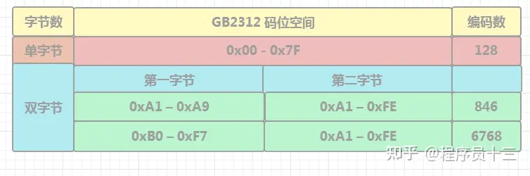

上图中 红色栏 表示 ASICII 的编码范围，绿色栏表示 GB2312 编码范围

### GBK 编码

和 GB2312 一样，GBK 也是双字节编码，为了向下兼容 GB2312， GBK 使用了 GB2312 没有用到的编码区域，总的编码范围是: 第一个字节 0x81–0xFE，第二个字节 0x40–0xFE， 具体的编码范围细分如下

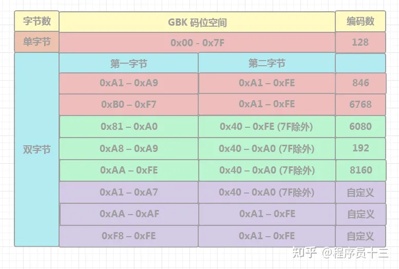

上述表格中，红色栏是 GBK 中包含的 GB2312 以及 ASICII 的编码范围，它们的编码范围保持不变

绿色栏的是 GBK 新增的编码范围

紫色栏是 用户自定义编码范围

### GB18030 编码

与 GBK 不同的是，GB18030 是**变长多字节字符集**，每个字或字符可以由一个，两个或四个字节组成，所以它的编码空间是很大的，最多可以容纳 161 万个字符

由于需要兼容 GBK，四个字节的前两个字节和 GBK 编码保持一致，GB18030 具体的编码范围如下

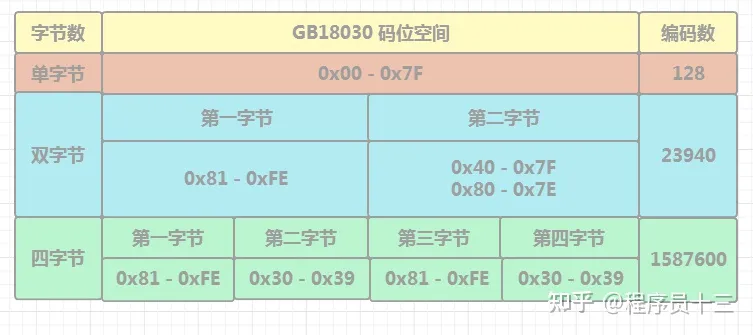

### GB18023与Unicode

再次强调，GB18030既是字符集又是编码格式，Unicode仅仅是字符集。

他们没有关系，是两套独立的编码标准。

为什么需要两套：
1、在 Unicode 出现之前，没有统一的字符编码，每个操作系统上都有自己的一套编码标准，像早期的 window 上需要安装字符集，才能支持中文，这里的字符集就是微软自定的标准，换个其他系统就会失效

2、对于大部分中文字符来说，采用 GB18030 编码的话，只需两个字节，如果采用 UTF8 编码，就需要三个字节， 所以用 GB18030 存储和传输更节省空间

### ASICII、GB2312、GBK、GB18030 以及 UTF8 的关系
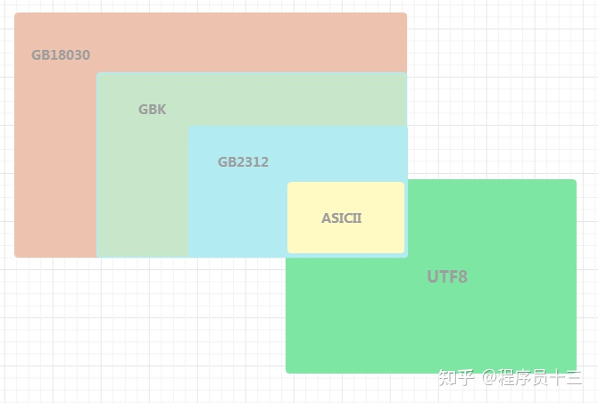

### 全角和半角字符

半角是ASCII码里的字符，每个字符占一个字节；全角是GB里的字符，每个字符占两个字节。

对于汉字来说，没有全角和半角之分。

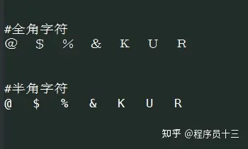

### 通过内码输入汉字的方法

有时需要输入一些特殊的字符，比如 带圆圈的数字字符 **①**，一般需要借助输入法的小键盘来输入

这里介绍一种使用字符内码来快速输入的方法： 按住 Alt 键不放，输入字符内码的十进制，输入完后松开 Alt 键

例如，输入带圆圈的数字 **②** 的步骤

1、查找带圆圈数字 2 的字符的编码 0xA2DA，十进制是 41690

2、按住 Alt 键不放，输入 41690，松开 Alt 键

3、输入完毕，这时就会出现字符 **②**

一般 Linux的 SSH 连接工具 或 windows 上的记事本，都支持内码输入

参考文献：
- [Unicode、UTF-8、UTF-16 终于懂了 - 知乎 (zhihu.com)](https://zhuanlan.zhihu.com/p/427488961?utm_id=0)
- [彻底搞明白 GB2312、GBK 和 GB18030 - 知乎 (zhihu.com)](https://zhuanlan.zhihu.com/p/453675608?utm_id=0)
