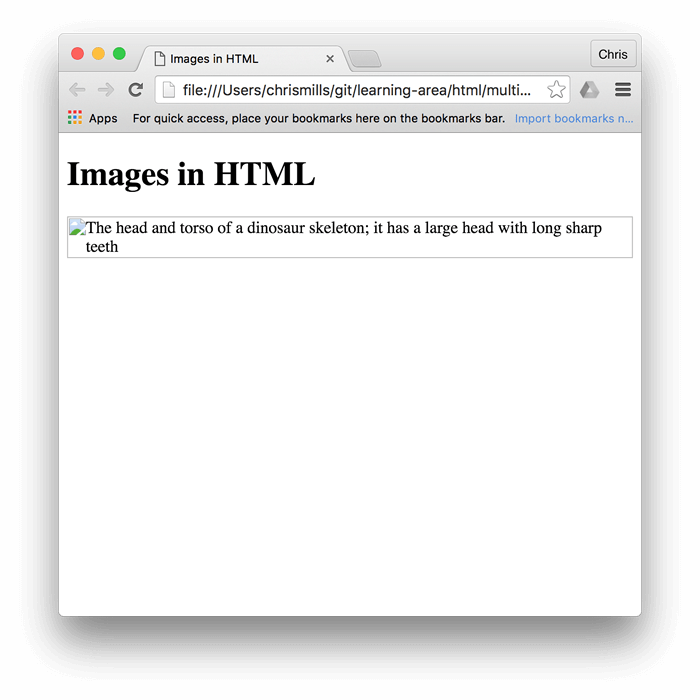
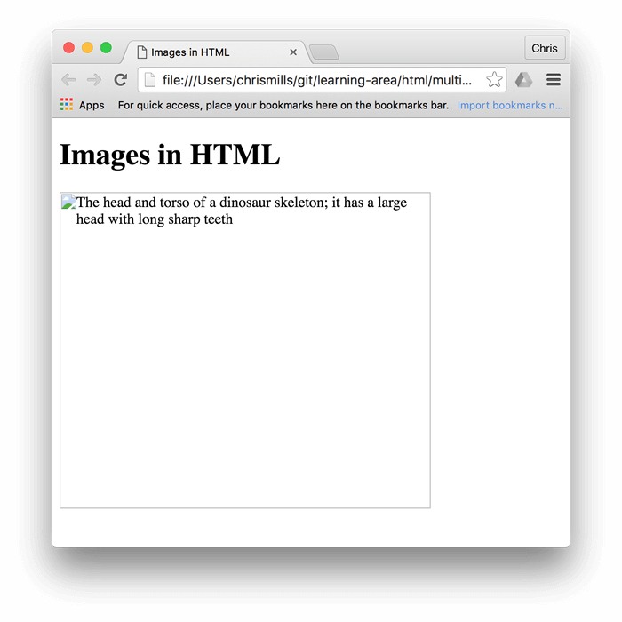

``void element.
`src`and`alt`(alternative text替代文本)attributes
the`href`or`<a>`
the`src`可以是relative URL or an absolute URL.

embed嵌入
```html

```
```html

```
:::note
**Note:** Search engines also read image filenames and count them towards SEO. Therefore, you should give your image a descriptive filename; `dinosaur.jpg` is better than `img835.png`.
:::
absolute URL
*不推荐*
```html

```
:::caution
**Warning:** _Never_ point the `src` attribute at an image hosted on someone else's website _without permission_. This is called "hotlinking". It is considered unethical, since someone else would be paying the bandwidth costs for delivering the image when someone visits your page. It also leaves you with no control over the image being removed or replaced with something embarrassing.
:::
:::note
**Note:** Elements like [``](https://developer.mozilla.org/en-US/docs/Web/HTML/Element/img) and [`<video>`](https://developer.mozilla.org/en-US/docs/Web/HTML/Element/video) are sometimes referred to as **replaced elements**. This is because the element's content and size are defined by an external resource (like an image or video file), not by the contents of the element itself. You can read more about them at [Replaced elements](https://developer.mozilla.org/en-US/docs/Web/CSS/Replaced_element).
:::
`alt`attribute
如果图片未加载会显示

### Width and height
```html

```
一般没什么，但是如果没加载出来浏览器会留一个空位

不应该用html来alter(改)图像大小，图片会扭曲。

## Image titles
可以加titles但是不推荐，鼠标悬浮会显示

## Media assets and licensing
[Images in HTML - Learn web development | MDN (mozilla.org)](https://developer.mozilla.org/en-US/docs/Learn/HTML/Multimedia_and_embedding/Images_in_HTML#media_assets_and_licensing)

Images (and other media asset types) you find on the web are released under various license types. Before you use an image on a site you are building, ensure you own it, have permission to use it, or comply with the owner's licensing conditions.

### [Understanding license types](https://developer.mozilla.org/en-US/docs/Learn/HTML/Multimedia_and_embedding/Images_in_HTML#understanding_license_types)

Let's look at some common categories of licenses you are likely to find on the web.

#### All rights reserved

Creators of original work such as songs, books, or software often release their work under closed copyright protection. This means that, by default, they (or their publisher) have exclusive rights to use (for example, display or distribute) their work. If you want to use copyrighted images with an _all rights reserved_ license, you need to do one of the following:

- Obtain explicit, written permission from the copyright holder.
- Pay a license fee to use them. This can be a one-time fee for unlimited use ("royalty-free"), or it might be "rights-managed", in which case you might have to pay specific fees per use by time slot, geographic region, industry or media type, etc.
- Limit your uses to those that would be considered [fair use](https://fairuse.stanford.edu/overview/fair-use/what-is-fair-use/) or [fair dealing](https://www.bl.uk/business-and-ip-centre/articles/fair-dealing-copyright-explained) in your jurisdiction.

Authors are not required to include a copyright notice or license terms with their work. Copyright exists automatically in an original work of authorship once it is created in a tangible medium. So if you find an image online and there are no copyright notices or license terms, the safest course is to assume it is protected by copyright with all rights reserved.

#### Permissive

If the image is released under a permissive license, such as [MIT](https://mit-license.org/), [BSD](https://opensource.org/license/BSD-3-clause/), or a suitable [Creative Commons (CC) license](https://creativecommons.org/choose/), you do not need to pay a license fee or seek permission to use it. Still, there are various licensing conditions you will have to fulfill, which vary by license.

For example, you might have to:

- Provide a link to the original source of the image and credit its creator.
- Indicate whether any changes were made to it.
- Share any derivative works created using the image under the same license as the original.
- Not share any derivative works at all.
- Not use the image in any commercial work.
- Include a copy of the license along with any release that uses the image.

You should consult the applicable license for the specific terms you will need to follow.
:::note
**Note:** You may come across the term "copyleft" in the context of permissive licenses. Copyleft licenses (such as the [GNU General Public License (GPL)](https://www.gnu.org/licenses/gpl-3.0.en.html) or "Share Alike" Creative Commons licenses) stipulate that derivative works need to be released under the same license as the original.
:::
Copyleft licenses are prominent in the software world. The basic idea is that a new project built with the code of a copyleft-licensed project (this is known as a "fork" of the original software) will also need to be licensed under the same copyleft license. This ensures that the source code of the new project will also be made available for others to study and modify. Note that, in general, licenses that were drafted for software, such as the GPL, are not considered to be good licenses for non-software works as they were not drafted with non-software works in mind.

Explore the links provided earlier in this section to read about the different license types and the kinds of conditions they specify.

#### Public domain/CC0

Work released into the public domain is sometimes referred to as "no rights reserved" — no copyright applies to it, and it can be used without permission and without having to fulfill any licensing conditions. Work can end up in the public domain by various means such as expiration of copyright, or specific waiving of rights.

One of the most effective ways to place work in the public domain is to license it under [CC0](https://creativecommons.org/share-your-work/public-domain/cc0/), a specific creative commons license that provides a clear and unambiguous legal tool for this purpose.

When using public domain images, obtain proof that the image is in the public domain and keep the proof for your records. For example, take a screenshot of the original source with the licensing status clearly displayed, and consider adding a page to your website with a list of the images acquired along with their license requirements.

### [Searching for permissively-licensed images](https://developer.mozilla.org/en-US/docs/Learn/HTML/Multimedia_and_embedding/Images_in_HTML#searching_for_permissively-licensed_images)

You can find permissive-licensed images for your projects using an image search engine or directly from image repositories.

Search for images using a description of the image you are seeking along with relevant licensing terms. For example, when searching for "yellow dinosaur" add "public domain images", "public domain image library", "open licensed images", or similar terms to the search query.

Some search engines have tools to help you find images with permissive licenses. For example, when using Google, go to the "Images" tab to search for images, then click "Tools". There is a "Usage Rights" dropdown in the resulting toolbar where you can choose to search specifically for images under creative commons licenses.

Image repository sites, such as [Flickr](https://flickr.com/), [ShutterStock](https://www.shutterstock.com/), and [Pixabay](https://pixabay.com/), have search options to allow you to search just for permissively-licensed images. Some sites exclusively distribute permissively-licensed images and icons, such as [Picryl](https://picryl.com/) and [The Noun Project](https://thenounproject.com/).

Complying with the license the image has been released under is a matter of finding the license details, reading the license or instruction page provided by the source, and then following those instructions. Reputable image repositories make their license conditions clear and easy to find.

## Annotating （注释） images with figures and figure captions
`<figure>` `<figcaption>`
目的：to provide a semantic container for figures
```html
<figure>
  

  <figcaption>
    A T-Rex on display in the Manchester University Museum.
  </figcaption>
</figure>
```
上图的`<figcaption>`如果用`<p>`写，图片多了对于读屏用户来说会分不清那个话是对应哪个图片。
:::note
**Note**:captions不论图片是否显示都显示，alt在图片消失时会显示。
:::
A figure doesn't have to be an image. It is an independent unit of content that:

- Expresses your meaning in a compact, easy-to-grasp way.
- Could go in several places in the page's linear flow.
- Provides essential information supporting the main text.

A figure could be several images, a code snippet, audio, video, equations, a table, or something else.

## CSS背景图片
可以用CSS开embed（嵌入）背景图

```css
p {
  background-image: url("images/dinosaur.jpg");
}
```

As hinted to above,如上所示。