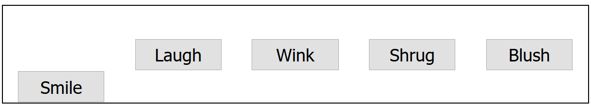

弹性盒子

父元素设置样式，子元素设置宽度。

## flex模型说明


- **主轴**（main axis）是沿着 flex 元素放置的方向延伸的轴（比如页面上的横向的行、纵向的列）。该轴的开始和结束被称为 **main start** 和 **main end**。
- **交叉轴**（cross axis）是垂直于 flex 元素放置方向的轴。该轴的开始和结束被称为 **cross start** 和 **cross end**。
- 设置了 `display: flex` 的父元素（在本例中是 [`<section>`](https://developer.mozilla.org/zh-CN/docs/Web/HTML/Element/section)）被称之为 **flex 容器（flex container）。**
- 在 flex 容器中表现为弹性的盒子的元素被称之为 **flex 项**（**flex item**）（本例中是 [`<article>`](https://developer.mozilla.org/zh-CN/docs/Web/HTML/Element/article) 元素。

## 行列

`flex-direction`指定**主轴的方向**。默认是`row`，会按浏览器默认语言方向排成一排。

:::note
你还可以使用 `row-reverse` 和 `column-reverse` 值反向排列 flex 项。
:::

## 换行

溢出了就换行。

`flex-wrap: wrap;`

同时在子元素中设置：

`flex: 200px`

上面这条声明表明至少为200px宽，会拉伸使整个行填满。

## flex-flow缩写

```css
flex-direction: row;
flex-wrap: wrap;
```
替换为
```css
flex-flow: row wrap;
```

## flex项的动态尺寸

```css
article {
  flex: 1;
}
```

```css
article:nth-of-type(3) {
  flex: 2;
}
```

这是一个无单位的比例值，表示每个 flex 项沿主轴的可用空间大小。本例中，我们设置 [`<article>`](https://developer.mozilla.org/zh-CN/docs/Web/HTML/Element/article) 元素的 flex 值为 1，这表示每个元素占用空间都是相等的，占用的空间是在设置 padding 和 margin 之后剩余的空间。因为它是一个比例，这意味着将每个 flex 项的设置为 400000 的效果和 1 的时候是完全一样的。

第三个 [`<article>`](https://developer.mozilla.org/zh-CN/docs/Web/HTML/Element/article) 元素占用了两倍的可用宽度。

```css
article {
  flex: 1 200px;
}

article:nth-of-type(3) {
  flex: 2 200px;
}
```

表示每个flex项将首先给出200px的可用空间，然后，剩余的空间再按照比例分配。

flex的意义在于灵活性/响应性，如果你改变浏览器窗口你会发现布局会跟着变化。

## flex：缩写与全写

[`flex`](https://developer.mozilla.org/zh-CN/docs/Web/CSS/flex) 是一个可以指定最多三个不同值的缩写属性：

- 第一个就是上面所讨论过的无单位比例。可以单独指定全写 [`flex-grow`](https://developer.mozilla.org/zh-CN/docs/Web/CSS/flex-grow) 属性的值。
- 第二个无单位比例——[`flex-shrink`](https://developer.mozilla.org/zh-CN/docs/Web/CSS/flex-shrink)——一般用于溢出容器的 flex 项。这指定了从每个 flex 项中取出多少溢出量，以阻止它们溢出它们的容器。这是一个相当高级的弹性盒子功能，我们不会在本文中进一步说明。
- 第三个是上面讨论的最小值。可以单独指定全写 [`flex-basis`](https://developer.mozilla.org/zh-CN/docs/Web/CSS/flex-basis) 属性的值。

不建议使用全写属性，除非你要覆盖。

## 水平和垂直对齐

```css
div {
  display: flex;
  align-items: center;
  justify-content: space-around;
}
```

[`align-items`](https://developer.mozilla.org/zh-CN/docs/Web/CSS/align-items) 控制 flex 项在交叉轴上的位置。

- 默认的值是 `stretch`，其会使所有 flex 项沿着交叉轴的方向拉伸以填充父容器。如果父容器在交叉轴方向上没有固定宽度（即高度），则所有 flex 项将变得与最长的 flex 项一样长（即高度保持一致）。我们的第一个例子在默认情况下得到相等的高度的列的原因。
- 在上面规则中我们使用的 `center` 值会使这些项保持其原有的高度，但是会在交叉轴居中。这就是那些按钮垂直居中的原因。
- 你也可以设置诸如 `flex-start` 或 `flex-end` 这样使 flex 项在交叉轴的开始或结束处对齐所有的值。查看 [`align-items`](https://developer.mozilla.org/zh-CN/docs/Web/CSS/align-items) 了解更多。

你可以用 [`align-self`](https://developer.mozilla.org/zh-CN/docs/Web/CSS/align-self) 属性覆盖 [`align-items`](https://developer.mozilla.org/zh-CN/docs/Web/CSS/align-items) 的行为。比如，你可以这样：
```css
button:first-child {
  align-self: flex-end;
}
```


[`justify-content`](https://developer.mozilla.org/zh-CN/docs/Web/CSS/justify-content) 控制 flex 项在主轴上的位置。

- 默认值是 `flex-start`，这会使所有 flex 项都位于主轴的开始处。
- 你也可以用 `flex-end` 来让 flex 项到结尾处。
- `center` 在 `justify-content` 里也是可用的，可以让 flex 项在主轴居中。
- 而我们上面用到的值 `space-around` 是很有用的——它会使所有 flex 项沿着主轴均匀地分布，在任意一端都会留有一点空间。
- 还有一个值是 `space-between`，它和 `space-around` 非常相似，只是它不会在两端留下任何空间。

## flex项排序

```css
button:first-child {
  order: 1;
}
```

刷新下，然后你会看到“Smile”按钮移动到了主轴的末尾。下面我们谈下它实现的一些细节：

- 所有 flex 项默认的 [`order`](https://developer.mozilla.org/zh-CN/docs/Web/CSS/order) 值是 0。
- order 值大的 flex 项比 order 值小的在显示顺序中更靠后。
- 相同 order 值的 flex 项按源顺序显示。所以假如你有四个元素，其 order 值分别是 2，1，1 和 0，那么它们的显示顺序就分别是第四，第二，第三，和第一。
- 第三个元素显示在第二个后面是因为它们的 order 值一样，且第三个元素在源顺序中排在第二个后面。

你也可以设置负值来使他们比0值的元素排的更靠前：
```css
button:last-child {
  order: -1;
}
```

## flex嵌套

```
section - article
          article
          article - div - button
                    div   button
                    div   button
                          button
                          button
```

```css
article {
  flex: 1 200px;
}

article:nth-of-type(3) {
  flex: 3 200px;
  display: flex;
  flex-flow: column;
}

article:nth-of-type(3) div:first-child {
  flex: 1 100px;
  display: flex;
  flex-flow: row wrap;
  align-items: center;
  justify-content: space-around;
}

button {
  flex: 1;
  margin: 5px;
  font-size: 18px;
  line-height: 1.5;
}

```

## 好东西
- [CSS 弹性盒子技巧](https://css-tricks.com/snippets/css/a-guide-to-flexbox/)——一篇以视觉吸引人的方式解释弹性盒子所有内容的文章
- [弹性盒子青蛙游戏](https://flexboxfroggy.com/)——学习和更好地了解弹性盒子基础知识的教育游戏

