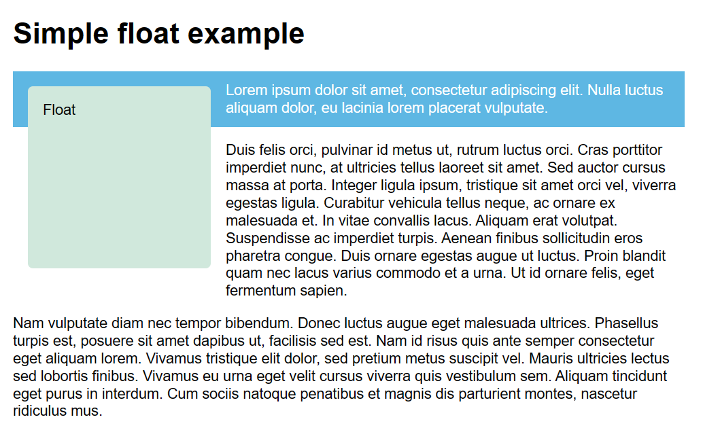
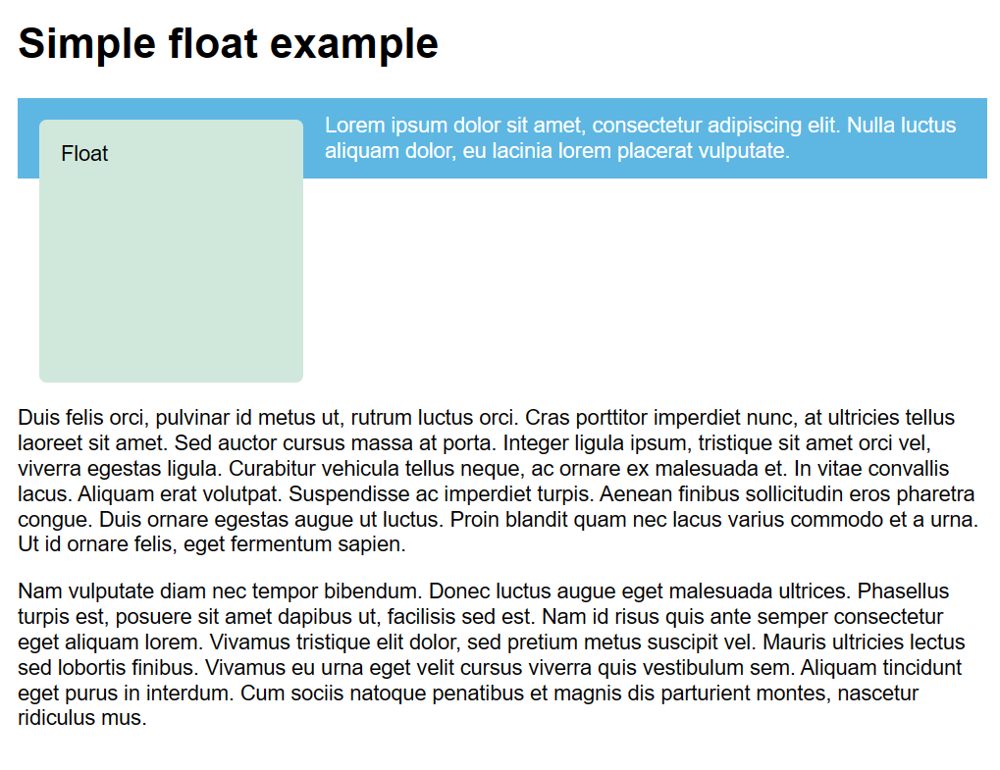
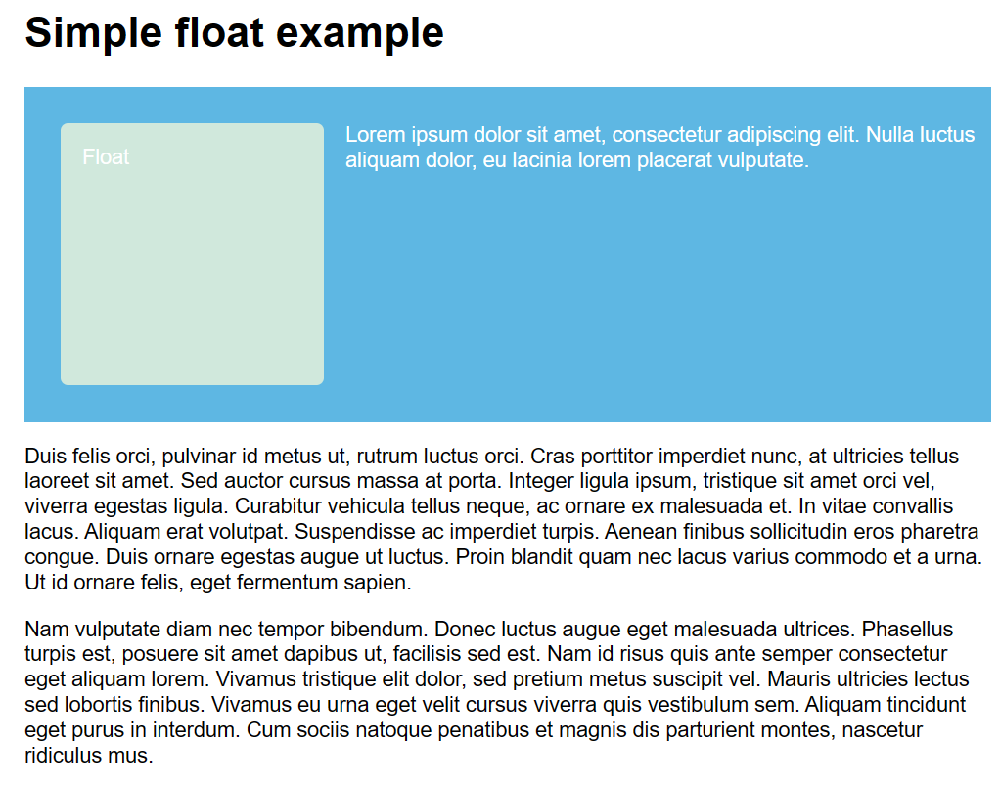

浮动

浮动会让元素脱离正常文档流。
## 浮动起来

`float`



## 清除浮动

`clear` 属性接受下列值：

- `left`：停止任何活动的左浮动
- `right`：停止任何活动的右浮动
- `both`：停止任何活动的左右浮动


## 使背景覆盖到浮动的盒子

### [display: flow-root](https://developer.mozilla.org/zh-CN/docs/Learn/CSS/CSS_layout/Floats#display_flow-root)
up-to-date最现代的解决方法。

`display: flow-root`它可以无需小技巧来创建[块级格式化上下文](https://developer.mozilla.org/zh-CN/docs/Web/Guide/CSS/Block_formatting_context)（BFC），在使用上没有副作用。


### [使用 overflow](https://developer.mozilla.org/zh-CN/docs/Learn/CSS/CSS_layout/Floats#%E4%BD%BF%E7%94%A8_overflow)

将包裹元素的 [`overflow`](https://developer.mozilla.org/zh-CN/docs/Web/CSS/overflow) 属性设置为除 `visible` 外的其他值。这个也设置了块级格式化文本上下文。

比如：`overflow: auto`
```css
.wrapper {
  background-color: rgb(79, 185, 227);
  padding: 10px;
  color: #fff;
  overflow: auto;
}
```

大部分情况下这种小技巧都可以奏效，但是可能会出现莫名其妙的滚动条或裁剪阴影，这是使用 overflow 带来的一些副作用。
### [clearfix 小技巧](https://developer.mozilla.org/zh-CN/docs/Learn/CSS/CSS_layout/Floats#clearfix_%E5%B0%8F%E6%8A%80%E5%B7%A7)
其过程为：先向包含浮动内容及其本身的盒子后方插入一些生成的内容，并将生成的内容清除浮动。
```css
.wrapper::after {
  content: "";
  clear: both;
  display: block;
}
```
```html
<div class="wrapper">
  <div class="float">Float</div>
  <p>This sentence appears next to the float.</p>
</div>
```


