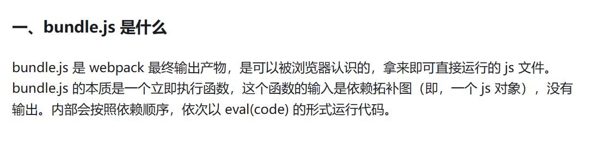
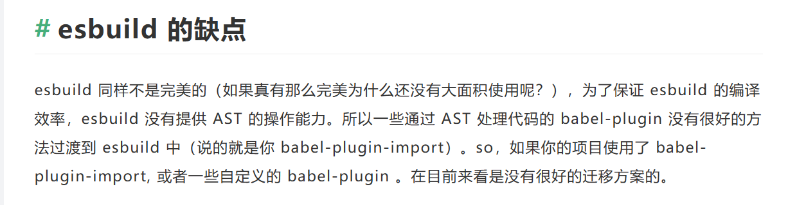

#Tech

# 主要内容
1. 今天了解了一下react的几个框架（脚手架）还有服务端渲染(SSR)（有利于首屏时间，SEO），客户端渲染（CSR）

2. 单页面应用（SPA），多页面应用（MPA），单页就是只在一个HTML中交互，有更好的用户体验不需要频繁跳转，但是SEO不友好，全由js渲染
	> 参考：[什么是单页面应用（SPA）？大白话介绍_spa应用-CSDN博客](https://blog.csdn.net/qq_36196059/article/details/105998807)

3. js的bundle有什么用
	> 参考：[(38 封私信 / 80 条消息) js 中 bundle 有什么作用？ - 知乎 (zhihu.com)](https://www.zhihu.com/question/578647024)
	> 
4. 还看了一下package.json和yarn.lock是干什么的。一个是依赖包的版本区间，一个是锁住具体的版本。以及可以在package.json中添加霸道的`resolutions`来强制锁，以**违背**版本区间的限制。
	> [yarn.lock 你锁明白了吗？ - 知乎 (zhihu.com)](https://zhuanlan.zhihu.com/p/400193691)
5. 以及package.json中`^~`，安装时哪个符号不改变大版本号和次要版本号。
	> [package.json中^,~的区别_package.json ^-CSDN博客](https://blog.csdn.net/peaceoncemore/article/details/79195206)
6. 还有什么是*懒加载*。
	>[懒加载 - Web 性能 | MDN (mozilla.org)](https://developer.mozilla.org/zh-CN/docs/Web/Performance/Lazy_loading)

## 什么还不知道？

今日新增疑惑🤨：
- bundle
- HMR
- AST（Abstract Syntax Tree）[AST抽象语法树——最基础的javascript重点知识，99%的人根本不了解 - node.js优雅之道 - SegmentFault 思否](https://segmentfault.com/a/1190000016231512#item-3-8)[AST抽象语法树——最基础的javascript重点知识，99%的人根本不了解 - node.js优雅之道 - SegmentFault 思否](https://segmentfault.com/a/1190000016231512#item-3-8)
- 

---

1. **Create React App (CRA)**:

- **优点**:

- [快速启动](https://www.zhihu.com/search?q=%E5%BF%AB%E9%80%9F%E5%90%AF%E5%8A%A8&search_source=Entity&hybrid_search_source=Entity&hybrid_search_extra=%7B%22sourceType%22%3A%22answer%22%2C%22sourceId%22%3A3207866487%7D)项目，无需配置即可开始开发。

- 配备了一套默认的构建工具和[开发环境](https://www.zhihu.com/search?q=%E5%BC%80%E5%8F%91%E7%8E%AF%E5%A2%83&search_source=Entity&hybrid_search_source=Entity&hybrid_search_extra=%7B%22sourceType%22%3A%22answer%22%2C%22sourceId%22%3A3207866487%7D)，使得开发者可以专注于编写代码。

- 有大量的社区支持和文档。

- **缺点**:

- 配置相对固定，不太适合需要高度自定义的项目。

- 对于某些高级配置需求，需要 [eject](https://www.zhihu.com/search?q=eject&search_source=Entity&hybrid_search_source=Entity&hybrid_search_extra=%7B%22sourceType%22%3A%22answer%22%2C%22sourceId%22%3A3207866487%7D)（弹出配置），这可能会使项目更复杂。

- **适用场景**:

- 快速原型开发或小型项目。

- 刚刚入门 React 的开发者。

  

2. **Next.js**:

- **优点**:

- 专注于服务器渲染 (SSR) 和静态网站生成 (SSG)，适合构建 SEO 友好的应用。

- 支持路由配置和动态导入组件，使得构建页面非常容易。

- 集成了许多优化和性能相关的功能。

- **缺点**:

- 不太适合单页面应用 (SPA)。

- 相对于 CRA，可能需要更多的配置。

- **适用场景**:

- 需要 SEO 优化的应用。

- 需要支持服务器渲染的应用。

  

3. **Webpack + Babel + 自定义配置**:

- **优点**:

- 完全自定义配置，适用于各种项目需求。

- 可以选择最适合项目的插件和工具。

- 学习配置可以提高对[构建工具](https://www.zhihu.com/search?q=%E6%9E%84%E5%BB%BA%E5%B7%A5%E5%85%B7&search_source=Entity&hybrid_search_source=Entity&hybrid_search_extra=%7B%22sourceType%22%3A%22answer%22%2C%22sourceId%22%3A3207866487%7D)的理解。

- **缺点**:

- 需要自己手动配置构建工具，可能需要更多的时间和经验。

- 配置错误可能会导致一些问题。

- **适用场景**:

- 大型项目或需要高度定制的项目。

- 对构建工具和配置有深入了解的开发者。