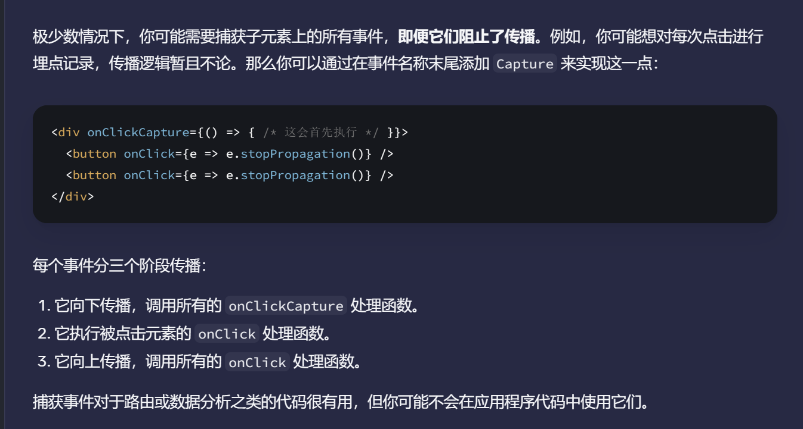

#Tech 

# 主要内容
1. react中setState（）之后没有重新渲染，是因为源码中只对变量进行了引用比较，没有进行值比较。
	> [React 源码分析 - setState() 之后没有重新渲染的问题原因与解决方法_setstate页面不渲染-CSDN博客](https://blog.csdn.net/vandavidchou/article/details/102618866)
2. React事件传播分三个阶段，如果想要捕获子元素上的所有事件，**即使他们阻止了传播**，可以通过事件名称末尾加`Capture`来实现。
	> 
3. React用一个数组来确定每一对useState的返回值，每一次setState后会改变下一次渲染从useState中返回的值。
	> 
4. 在渲染树上哪个结点触发了渲染，React会递归渲染其所有子节点。
5. **React 仅在渲染之间存在差异时才会更改 DOM 节点**，其步骤如下
	1. 触发渲染
	2. 渲染
	3. 提交到DOM上
	4. 浏览器渲染
6. **每一次渲染的state值都是固定的**，setState只会改变下一次渲染（从函数从上到下开始执行的头部生命useState处获取state值）的State值。
7. 如果**这次**渲染中有多次setState改变state的值会进入队列如果想根据prevState的值连续更新可以用**更新函数**，