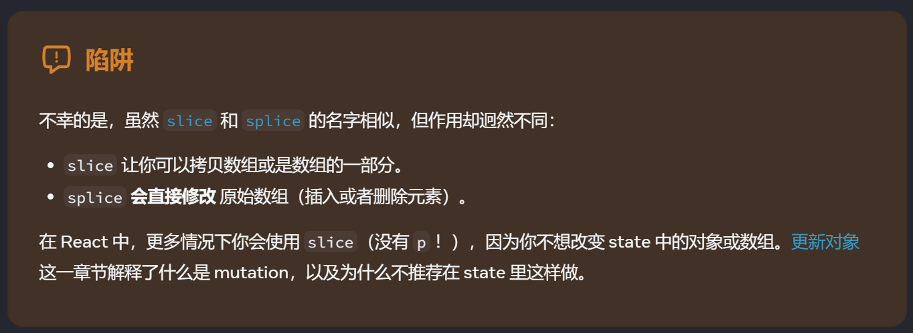

#Tech 

# 主要内容

1. 对象并非是真正嵌套的，事实上是好几个对象通过*引用*来链接。
2. 如果使用mutation直接改变state，对于`console.log`打印的之前的state值会被改变。
3. 记得要用一下Immer包里的updateState。
4. 一些数组的方法需要注意

|      | 避免使用 (会改变原始数组)             | 推荐使用 (会返回一个新数组）                                                                                             |
| ---- | -------------------------- | ----------------------------------------------------------------------------------------------------------- |
| 添加元素 | `push`，`unshift`           | `concat`，`[...arr]` 展开语法（[例子](https://zh-hans.react.dev/learn/updating-arrays-in-state#adding-to-an-array)） |
| 删除元素 | `pop`，`shift`，`splice`     | `filter`，`slice`（[例子](https://zh-hans.react.dev/learn/updating-arrays-in-state#removing-from-an-array)）     |
| 替换元素 | `splice`，`arr[i] = ...` 赋值 | `map`（[例子](https://zh-hans.react.dev/learn/updating-arrays-in-state#replacing-items-in-an-array)）           |
| 排序   | `reverse`，`sort`           | 先将数组复制一份（[例子](https://zh-hans.react.dev/learn/updating-arrays-in-state#making-other-changes-to-an-array)）   |

