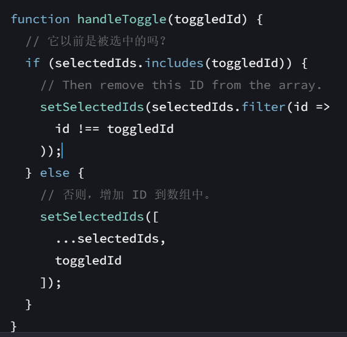

#Tech #React 

# 主要内容
1. 不要命令式地考虑UI，要声明式地。什么*触发*状态改变，然后*呈现*什么UI。
2. useState会在组件第一次渲染时初始化，后面调用不会初始化，只会返回值。所以考虑好是否要用props传过来的值作useState的值。
3. 选择State解构中的第三个挑战很有意思（修复消失的选项），演示了一个避免“重复的state“问题。
4. 熟练运动数组方法，构建一个类似set的集合。但是这种情况更推荐使用集合Set，因为set的`has()`方法非常快，而数组的`includes()`方法搜索需要线性时间。（这不是我说的，React官方文档）
	> 
	
5. 一个有趣的简单搜索，还有一些有趣的数组方法（arr.some(fn),arr.every(fn)），类似于&&和||
	> 
6. 状态不是“存在”在组件内，而是由React保存，通过组件在渲染树中的位置将它保存的每个状态与正确的组件关联起来。
7. 相同位置的相同组件的state会被保存，相同位置指的是组件在UI树中的位置，而不是JSX中的位置。
8. 不应该把组件函数的定义嵌套起来，因为每次渲染的时候，内部的组件函数会被重新定义