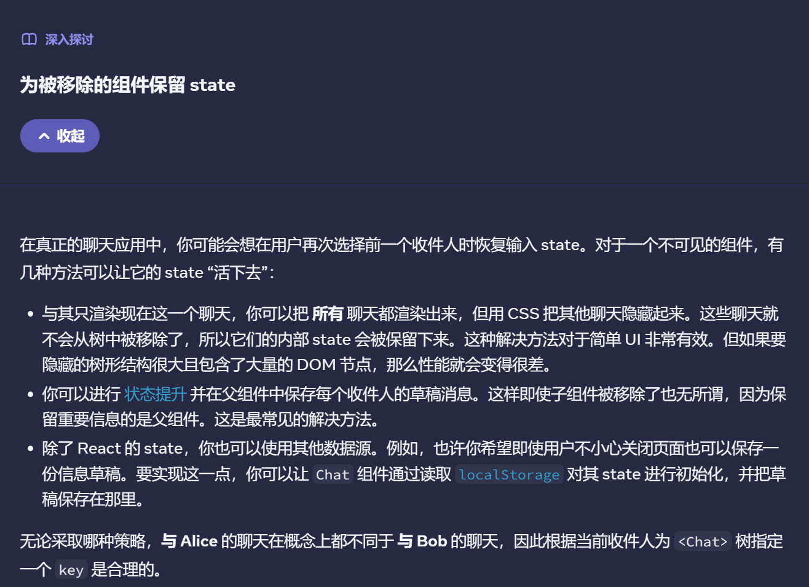

#Tech 

# 主要内容
1. 使用key可以让React区分组件（默认情况会使用父组件内部的顺序区分），但不是全局唯一。
2. 
3. 对state进行保留和重置中的第一个挑战，很好的解释了组件在树中的位置，比如：`{null}`当做第一个组件的时候`<Form/>`就是第二个组件。
4. 对state进行保留和重置中的第二个挑战，对两个不同的组件进行位置调换保留了state，似乎并不会销毁组件。
5. 第四个挑战，可以很好的实现对内容加载（类似于在同一个``元素）的一对一响应。
6. `reducer`是以数组上的`reducer()`方法命名的，传递给`reducer`的函数被称为*reducer*。他接受目前的结果和当前的值，返回下一个结果。
7. 更准确的reducer实现，这是因为被派发（dispatch）的actions在下一次渲染之前都是处于排队状态的。
	> ```jsx
	> function dispatch(action) {
	> 	setState((s) => reducer(s, action))
	> }
```
