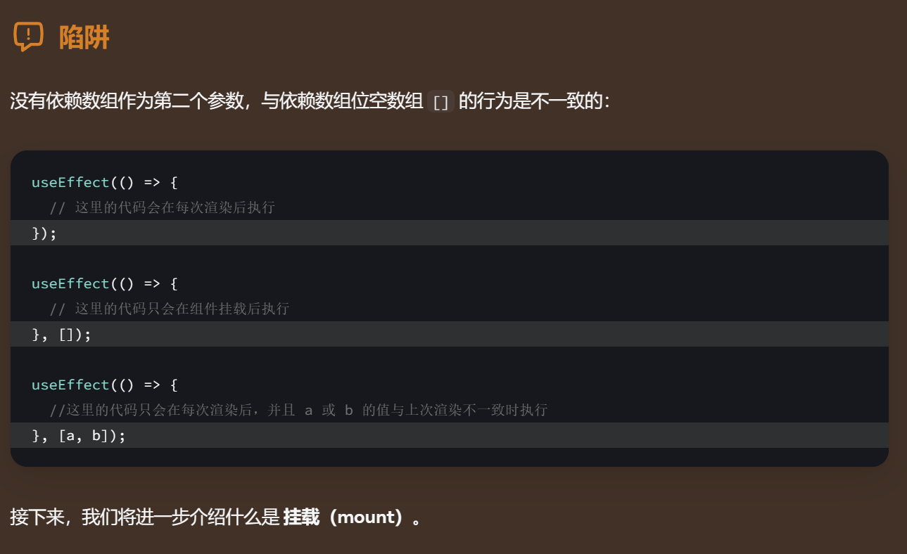
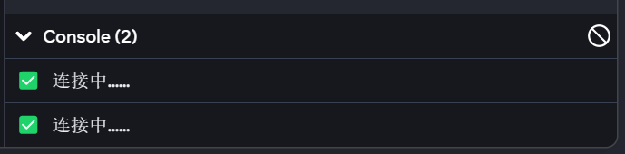
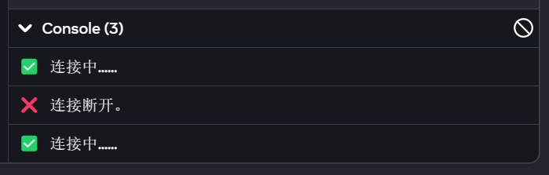

#Tech 

过了好久，终于有时间继续学React了。

# 还是Ref
1. scrollIntoView()浏览器API
2. 使用ref回调管理ref列表
3. React不允许组件访问其他组件的DOM节点，甚至自己的子组件也不行。
4. 可以限制暴露的功能用`useImperativeHandle`，此时父组件获取的ref值不是DOM节点，而是在`useImperativeHandle`中创建的自定义对象。
5. React在提交时设置`ref.current`
6. `ref`回调函数当DOM节点被添加到屏幕上时，使用此节点调用ref回调函数。
7. 使用`flushSync`同步更新`state`。
---
# 不是Ref了，现在是Effect
1. 依赖数组可以包含多个依赖项。当指定的所有依赖项在上一次渲染期间的值与当前值完全相同时，React 会跳过重新运行该 Effect。React 使用 [`Object.is`](https://developer.mozilla.org/zh-CN/docs/Web/JavaScript/Reference/Global_Objects/Object/is) 比较依赖项的值。
2. 为什么依赖数组中可以省略ref: 因为`ref`具有 **稳定** 的标识( React保证每次渲染调用`useRef`所产生的对象引用总是相同的 ) ，另外`useState` 返回的 [`set` 函数](https://zh-hans.react.dev/reference/react/useState#setstate) 也有稳定的标识符。
3. 使用`[]`空数组作为依赖数组时，仅会在 **挂载** (组件第一次渲染出现在屏幕上) 时运行Effect代码。然而在开发环境 (`<RestrictMode>`) 中会运行两次来帮助发现错误。例如连接不断堆积[^1]。
4. 返回值会返回一个清理函数，每次重新执行 Effect 之前，React 都会调用清理函数；组件被卸载时，也会调用清理函数。
---

`flushSync`怎么用:

```jsx
flushSync(() => {
	setTodos([...todos, newTodo]);
});
listRef.current.lastChild.scrollIntoView();
```

使用ref回调管理ref列表
- 三个函数

```jsx
function getMap() {
	if (!itemsRef.current) {
	// 首次运行时初始化Map.
	itemsRef.current = new Map();
	}
	return itemsRef.current;
}

function scrollToId(itemId) {
	const map = getMap();
	const node = map.get(itemId);
	node.scrollIntoView({
		behavior: 'smooth',
		block: 'nearest',
		inline: 'center'
	})
}


<ul>
	{catList.map(cat => (
		<li
			key={cat.id}
			ref={(node) => {
				const map = getMap();
				if (node) {
				map.set(cat.id, node);
				} else {
					map.delete(cat.id);
				}
			}}
	))}
</ul>

```

`forwardRef`可以这样改造组件:
```jsx
import {forwardRef} from 'react';

export default forwardRef(
	function SearchButton(props, ref) {
		return (
			<input
				ref={ref}
				placeholder="找什么呢？"
			/>
		);
	}
)

// 正常使用
<SearchButton ref={inputRef} />

```

还可以这样
```jsx
const MyInput = forwardRef((props, ref) => {
	const realInputRef = useRef(null);
	useImperativeHandle(ref, () => ({
		// 只暴露 focus，没有别的
		//注意这是返回一个自定义对象
		focus() {
			realInputRef.current.focus();
		}
	}));
	return <input {...props} ref={realInputRef} />;
});

// 正常使用
<MyInput ref={inputRef} />
```





[^1]: 不符合预期的输出：
符合预期的输出:
