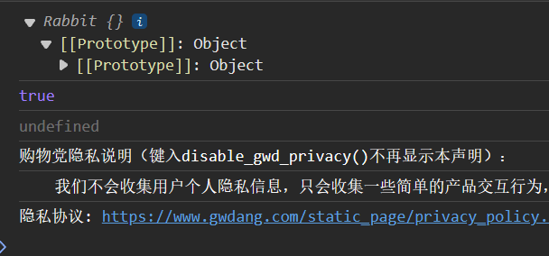
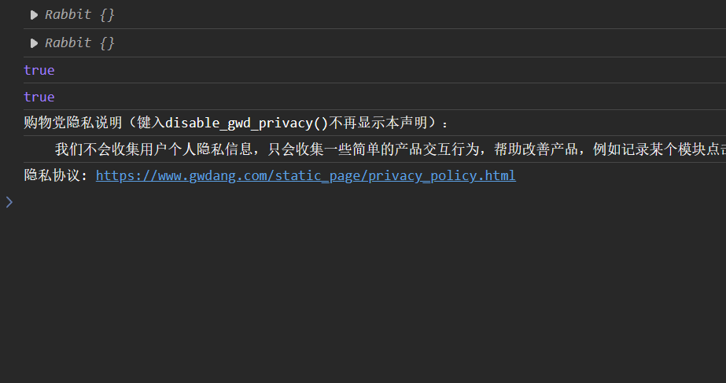

[(36 封私信 / 80 条消息) JS入门 对象的delete函数会影响console.log输出吗？ - 知乎 (zhihu.com)](https://www.zhihu.com/question/511182949)

为什么会发现这个问题，原由是在学习prototype时候测试了如下代码：
```js
let obj = {
    eats: true
};

function Rabbit() { }

Rabbit.prototype = obj;
let rabbit = new Rabbit();
console.log()
Rabbit.prototype = {};

console.log(rabbit.eats); //true

delete obj.eats;

console.log(rabbit.eats);//undefine
```

结果控制台显示的对象原型里没有eats属性，似乎delete先于console.log()删掉了eats，


实际上是浏览器的一个bug，console.log具有及时性，在你点击的那一刻确定并保存不变。

